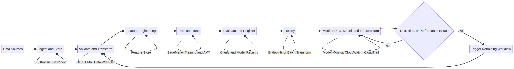
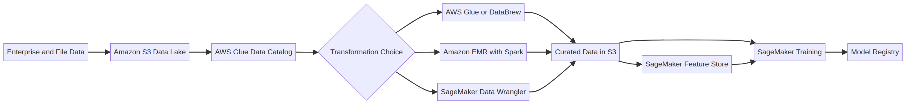
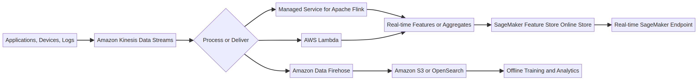
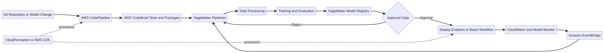
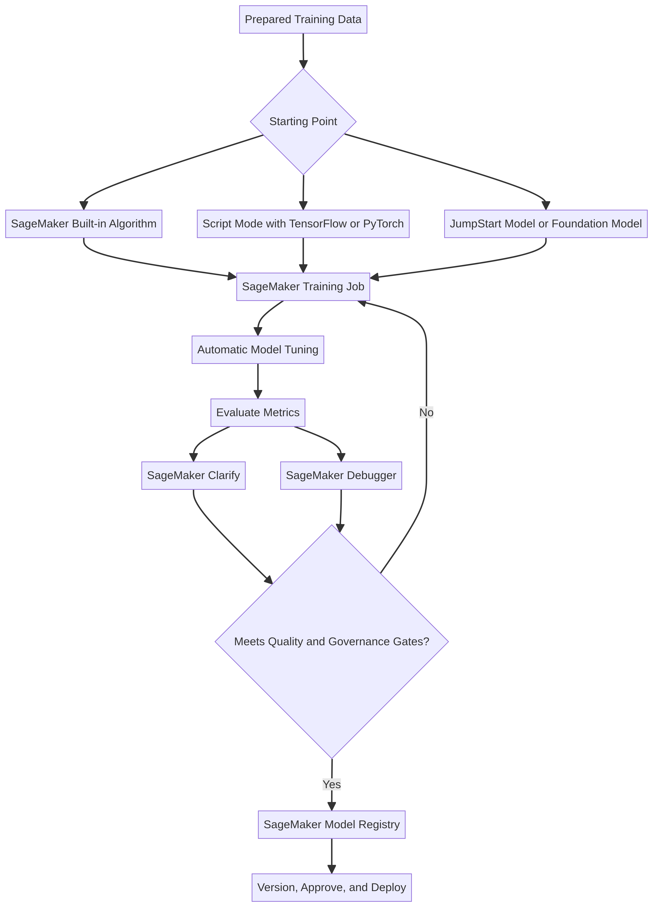
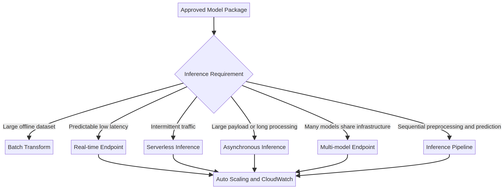
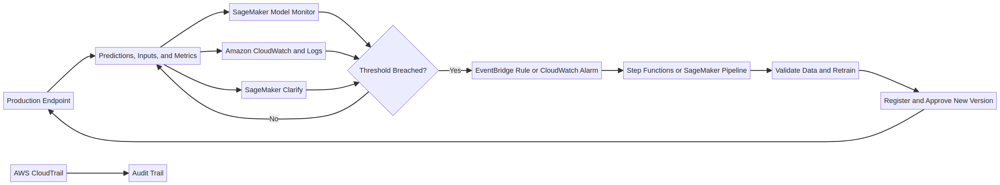
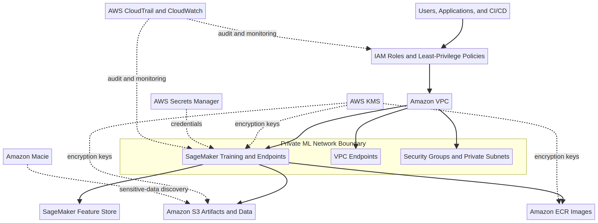

# MLA-C01 AWS Services Handbook

**AWS Certified Machine Learning Engineer – Associate**  
**Exam code:** MLA-C01  

## Purpose and Scope

This handbook explains every AWS service named in the **in-scope services and features** appendix of the official MLA-C01 exam guide. The appendix explicitly describes the list as **non-exhaustive and subject to change**.[^exam-guide] Consequently, this handbook is a coverage map—not a claim that all listed services appear equally often or require equal study time. The most effective preparation strategy is to master the services that implement the tested ML lifecycle, then learn supporting and awareness-level services as scenario-selection options.

## Exam Domains

| Label | Official domain | Weight |
|---|---|---:|
| **D1** | Data Preparation for Machine Learning | 28% |
| **D2** | ML Model Development | 26% |
| **D3** | Deployment and Orchestration of ML Workflows | 22% |
| **D4** | ML Solution Monitoring, Maintenance, and Security | 24% |

## Study-Priority Legend

| Priority | Meaning | Recommended teaching depth |
|---|---|---|
| **Core** | Directly implements one or more central task statements in the exam guide. | Demonstrate, compare, and practice with scenario questions. |
| **Supporting** | Frequently connects the core workflow to data, orchestration, deployment, governance, or operations. | Explain capabilities, trade-offs, and integration points. |
| **Awareness** | Included in the official appendix but usually relevant as a specialized managed option or distractor. | Teach the problem it solves and the key decision rule. |

### Core Study Set

| Lifecycle area | Highest-priority services and features |
|---|---|
| Data storage and ingestion | Amazon S3, Amazon Kinesis Data Streams, Amazon Data Firehose, Amazon EBS, Amazon EFS, Amazon FSx, AWS DataSync |
| Data preparation | AWS Glue, AWS Glue DataBrew, AWS Glue Data Quality, Amazon EMR, Amazon Athena, SageMaker Data Wrangler, SageMaker Feature Store, SageMaker Ground Truth |
| Model development | Amazon SageMaker training, built-in algorithms, script mode, Automatic Model Tuning, JumpStart, Experiments, Debugger, Clarify |
| Governance and model lifecycle | SageMaker Model Registry, SageMaker Pipelines, SageMaker Projects, AWS CodePipeline, AWS CodeBuild, Amazon ECR |
| Deployment | SageMaker real-time endpoints, serverless inference, asynchronous inference, batch transform, multi-model endpoints, inference pipelines, auto scaling |
| Monitoring and retraining | SageMaker Model Monitor, SageMaker Clarify, Amazon CloudWatch, CloudWatch Logs, AWS CloudTrail, Amazon EventBridge, AWS Step Functions |
| Security | IAM, AWS KMS, Amazon VPC, security groups, private subnets, VPC endpoints, AWS Secrets Manager, Amazon Macie |
| Cost and performance | AWS Cost Explorer, AWS Budgets, AWS Trusted Advisor, AWS Compute Optimizer, SageMaker Inference Recommender |

## End-to-End ML Lifecycle

The diagram is intentionally cyclical. MLA-C01 tests not only model creation but also the operational feedback loop: monitoring can detect drift, bias, performance degradation, or infrastructure issues and then trigger a governed retraining and redeployment workflow.

## Fast Service-Selection Map

| Requirement clue | First service or pattern to evaluate | Closest alternatives to eliminate |
|---|---|---|
| Ad-hoc SQL directly over files in S3 | **Amazon Athena** | Redshift for a managed warehouse; EMR for customized distributed processing |
| Serverless ETL and a shared metadata catalog | **AWS Glue** | EMR for cluster-level control; DataBrew for visual preparation |
| Visual ML-focused data preparation | **SageMaker Data Wrangler** | Glue DataBrew for general no-code preparation |
| Stateful, windowed stream processing | **Managed Service for Apache Flink** | Lambda for shorter stateless event processing |
| Durable stream with custom consumers | **Kinesis Data Streams** | Data Firehose for managed delivery to destinations |
| Managed delivery of streaming records to S3 or OpenSearch | **Amazon Data Firehose** | Kinesis Data Streams when custom consumer logic is required |
| Reusable online and offline model features | **SageMaker Feature Store** | S3 alone when online feature retrieval and feature governance are not required |
| Human review of low-confidence predictions | **Amazon A2I** | Ground Truth for dataset labeling before or during training |
| Orchestrate AWS services with branching and retries | **AWS Step Functions** | MWAA when Apache Airflow compatibility is required; SageMaker Pipelines for ML-native workflow steps |
| Long-running inference or large payload | **SageMaker asynchronous inference** | Real-time endpoints for consistently low latency; batch transform for offline datasets |
| Intermittent real-time inference traffic | **SageMaker Serverless Inference** | Provisioned real-time endpoint for predictable throughput |
| Detect feature or prediction drift | **SageMaker Model Monitor** | CloudWatch for infrastructure and application telemetry |
| Explainability and bias analysis | **SageMaker Clarify** | Model Monitor when the main requirement is continuous production-quality monitoring |
| Audit AWS API activity | **AWS CloudTrail** | CloudWatch for metrics, logs, dashboards, and alarms |
| Discover sensitive data in S3 | **Amazon Macie** | KMS for encryption; IAM and bucket policies for access control |

## Diagram Index

| Diagram | Main services and decisions |
|---|---|
| [Batch data pipeline](#batch-data-pipeline) | S3, Glue, EMR, Data Wrangler, Feature Store, SageMaker training |
| [Streaming ML pipeline](#streaming-ml-pipeline) | Kinesis, Flink, Lambda, Data Firehose, Feature Store |
| [Model development and registry](#model-development-and-registry) | Training, AMT, Clarify, Debugger, Model Registry |
| [Inference selection](#sagemaker-inference-selection) | Batch, real-time, serverless, asynchronous, multi-model, pipelines |
| [ML CI/CD](#ml-cicd-and-orchestration) | CodePipeline, CodeBuild, SageMaker Pipelines, Model Registry, IaC |
| [Monitoring and retraining](#monitoring-and-retraining-loop) | Model Monitor, CloudWatch, Clarify, CloudTrail, EventBridge |
| [Security boundaries](#security-boundaries-for-ml-workloads) | IAM, VPC, KMS, Secrets Manager, Macie, CloudTrail |

[^exam-guide]: [AWS Certified Machine Learning Engineer – Associate (MLA-C01) Exam Guide, Version 1.0](https://d1.awsstatic.com/training-and-certification/docs-machine-learning-engineer-associate/AWS-Certified-Machine-Learning-Engineer-Associate_Exam-Guide.pdf)

---

---

## Batch Data Pipeline

## Streaming ML Pipeline

---

## Category 01 — Analytics

| Service | Core ML Role | Exam Domain(s) |
|---|---|---|
| Amazon Athena | Serverless interactive SQL querying and ML inference | D1, D2 |
| Amazon Data Firehose | Near real-time streaming data delivery and transformation | D1, D3 |
| Amazon EMR | Big data processing framework for Spark, Hadoop, and ML | D1, D2 |
| AWS Glue | Serverless data integration and ETL orchestration | D1 |
| AWS Glue DataBrew | Visual data preparation and profiling | D1 |
| AWS Glue Data Quality | ML-powered data quality monitoring and anomaly detection | D1, D4 |
| Amazon Kinesis | Real-time streaming data ingestion and processing | D1 |
| AWS Lake Formation | Data lake security, governance, and access control | D1, D4 |
| Amazon Managed Service for Apache Flink | Stateful stream processing and real-time analytics | D1, D3 |
| Amazon OpenSearch Service | Search, log analytics, and vector database for ML | D1, D3 |
| Amazon QuickSight | ML-powered business intelligence and visualization | D1, D4 |
| Amazon Redshift | Cloud data warehousing and SQL-based ML | D1, D2 |

### Amazon Athena

**What it is:** Amazon Athena is a serverless, interactive query service that enables users to analyze data directly in Amazon S3 using standard SQL [c01-1]. It requires no infrastructure management and charges based on the amount of data scanned per query.

**Role in an ML workload:** Athena is primarily used for data exploration, feature engineering, and ad-hoc analysis of large datasets stored in a data lake. It can also invoke Amazon SageMaker machine learning models directly within SQL queries to perform batch inference on S3 data [c01-2].

**High-value MLA-C01 use cases:** Athena is ideal for querying raw or processed data in S3 to validate data quality, extract features for model training, or analyze model predictions. Its ability to run ML inference via SQL makes it valuable for analysts who want to apply ML models without writing complex application code.

**Important features or configuration decisions:** Athena supports various data formats, including CSV, JSON, ORC, Avro, and Parquet. Using columnar formats like Parquet and partitioning data significantly reduces query costs and improves performance. Athena integrates natively with the AWS Glue Data Catalog to store table metadata.

**Common confusion or comparison:** Athena is often compared to Amazon Redshift. Athena is best for ad-hoc, serverless querying directly against S3 data lakes, while Redshift is a dedicated data warehouse optimized for complex, high-performance analytics on structured data.

**Exam decision rule:** If a scenario requires running ad-hoc SQL queries on data in S3 without provisioning infrastructure, or invoking SageMaker models using SQL, choose Amazon Athena.

**Primary exam domain(s):** D1 (Data Preparation for Machine Learning), D2 (ML Model Development).

### Amazon Data Firehose

**What it is:** Amazon Data Firehose (formerly Amazon Kinesis Data Firehose) is a fully managed service that reliably captures, transforms, and delivers streaming data to data lakes, data stores, and analytics services [c01-3].

**Role in an ML workload:** Firehose is a critical component for ingesting near real-time data streams (e.g., logs, clickstreams, IoT telemetry) and delivering them to storage destinations like Amazon S3 or Amazon OpenSearch Service for ML training or analysis.

**High-value MLA-C01 use cases:** Firehose is used to build data ingestion pipelines that automatically load streaming data into S3 data lakes. It can also perform inline data transformations using AWS Lambda before delivering the data, which is useful for cleaning or formatting data for ML models.

**Important features or configuration decisions:** Firehose buffers incoming data based on size (e.g., 1-128 MB) or time (e.g., 60-900 seconds) before delivering it to the destination. It supports format conversion (e.g., JSON to Parquet) to optimize data for downstream analytics.

**Common confusion or comparison:** Firehose is frequently confused with Amazon Kinesis Data Streams. Firehose is designed for data delivery (loading data into destinations) with built-in buffering and transformation, while Kinesis Data Streams is for building custom, real-time streaming applications that require low-latency processing.

**Exam decision rule:** If the goal is to reliably deliver streaming data to Amazon S3, Amazon Redshift, or Amazon OpenSearch Service with minimal configuration and optional Lambda transformations, choose Amazon Data Firehose.

**Primary exam domain(s):** D1 (Data Preparation for Machine Learning), D3 (Deployment and Orchestration of ML Workflows).

### Amazon EMR

**What it is:** Amazon EMR is a managed cluster platform that simplifies running big data frameworks, such as Apache Hadoop, Apache Spark, and Presto, on AWS to process and analyze vast amounts of data [c01-4].

**Role in an ML workload:** EMR is heavily used for large-scale data processing, feature engineering, and distributed model training. It provides a scalable environment for running Spark MLlib or deep learning frameworks across clusters of EC2 instances.

**High-value MLA-C01 use cases:** EMR is the go-to solution for processing massive datasets that exceed the capacity of single instances. It is used to run complex ETL jobs, train distributed ML models, and perform large-scale data transformations required for ML pipelines.

**Important features or configuration decisions:** EMR clusters consist of master, core, and task nodes. Task nodes can use Amazon EC2 Spot Instances to significantly reduce costs for fault-tolerant workloads. EMR integrates with Amazon S3 (EMRFS) to decouple compute and storage, allowing clusters to be transient.

**Common confusion or comparison:** EMR is often compared to AWS Glue. EMR provides full control over the underlying cluster and big data frameworks, making it suitable for long-running or highly customized workloads. AWS Glue is a serverless ETL service that abstracts infrastructure management.

**Exam decision rule:** If a scenario involves processing massive datasets using Apache Spark or Hadoop, requires fine-grained control over cluster configuration, or involves migrating existing big data workloads to AWS, choose Amazon EMR.

**Primary exam domain(s):** D1 (Data Preparation for Machine Learning), D2 (ML Model Development).

### AWS Glue

**What it is:** AWS Glue is a serverless data integration service that makes it easy to discover, prepare, and combine data for analytics, machine learning, and application development [c01-5].

**Role in an ML workload:** Glue is the backbone of many ML data pipelines. It performs extract, transform, and load (ETL) operations to clean, enrich, and format data before it is used for model training. The AWS Glue Data Catalog serves as a central metadata repository.

**High-value MLA-C01 use cases:** Glue is used to automate data preparation workflows. Glue crawlers automatically discover data schema and populate the Data Catalog. Glue jobs (Python shell or PySpark) execute ETL scripts to transform raw data into ML-ready formats.

**Important features or configuration decisions:** Glue provides built-in ML transforms, such as FindMatches, which uses machine learning to identify duplicate records across datasets even when they lack a common identifier. Glue workflows orchestrate complex ETL pipelines.

**Common confusion or comparison:** Glue is often compared to Amazon EMR. Glue is serverless and ideal for standard ETL tasks without managing infrastructure. EMR is better for workloads requiring custom cluster configurations or specific big data ecosystem tools.

**Exam decision rule:** If the requirement is to perform serverless ETL, automatically discover data schemas using crawlers, or deduplicate records using built-in ML transforms, choose AWS Glue.

**Primary exam domain(s):** D1 (Data Preparation for Machine Learning).

### AWS Glue DataBrew

**What it is:** AWS Glue DataBrew is a visual data preparation tool that enables data analysts and data scientists to clean and normalize data without writing code [c01-6].

**Role in an ML workload:** DataBrew accelerates the data preparation phase by providing a visual interface to profile data, identify anomalies, and apply transformations before the data is used for ML model training.

**High-value MLA-C01 use cases:** DataBrew is used to quickly assess data quality, handle missing values, detect outliers, and standardize formats. It is particularly valuable for teams that prefer a no-code approach to feature engineering and data cleansing.

**Important features or configuration decisions:** DataBrew offers over 250 pre-built transformations. It generates data profile reports that highlight statistics, correlations, and data quality issues. Transformation recipes can be saved and automated as part of a data pipeline.

**Common confusion or comparison:** DataBrew is compared to AWS Glue Studio and Amazon SageMaker Data Wrangler. DataBrew is a standalone visual tool for general data preparation. Glue Studio is for visually authoring Glue ETL jobs. SageMaker Data Wrangler is specifically integrated into the SageMaker ecosystem for ML feature engineering.

**Exam decision rule:** If a scenario requires a visual, no-code tool to profile data, clean datasets, and apply pre-built transformations for data preparation, choose AWS Glue DataBrew.

**Primary exam domain(s):** D1 (Data Preparation for Machine Learning).

### AWS Glue Data Quality

**What it is:** AWS Glue Data Quality is a feature that automatically measures and monitors the quality of data in data lakes and data pipelines [c01-7].

**Role in an ML workload:** Ensuring high data quality is critical for ML model accuracy. Glue Data Quality helps detect anomalies, missing values, and schema changes in the data used for training and inference, preventing "garbage in, garbage out" scenarios.

**High-value MLA-C01 use cases:** It is used to enforce data quality rules during ETL processes. It can automatically evaluate data against predefined rules and halt pipelines or trigger alerts if the data quality falls below acceptable thresholds.

**Important features or configuration decisions:** Glue Data Quality uses machine learning to analyze data and automatically recommend data quality rules. It integrates seamlessly with AWS Glue Data Catalog and Glue ETL jobs.

**Common confusion or comparison:** It is a specific feature within the AWS Glue ecosystem, distinct from general ETL (Glue Jobs) or visual preparation (DataBrew), focusing exclusively on rule-based and ML-driven data quality monitoring.

**Exam decision rule:** If the goal is to automatically monitor data quality, generate data quality rules using ML, and enforce these rules within data pipelines, choose AWS Glue Data Quality.

**Primary exam domain(s):** D1 (Data Preparation for Machine Learning), D4 (ML Solution Monitoring, Maintenance, and Security).

### Amazon Kinesis

**What it is:** Amazon Kinesis is a platform for streaming data on AWS, offering powerful services to make it easy to load and analyze streaming data, and also providing the ability for you to build custom streaming data applications for specialized needs [c01-8]. In the context of the exam, this primarily refers to Amazon Kinesis Data Streams.

**Role in an ML workload:** Kinesis Data Streams is used to ingest real-time, high-throughput data streams (e.g., clickstreams, IoT sensor data) that require immediate processing or ML inference.

**High-value MLA-C01 use cases:** Kinesis is essential for real-time ML applications, such as fraud detection, anomaly detection, or real-time recommendations, where data must be processed and analyzed as soon as it is generated.

**Important features or configuration decisions:** Kinesis Data Streams is composed of shards. The number of shards determines the throughput capacity of the stream. Data is retained in the stream for a configurable period (default 24 hours, up to 365 days), allowing multiple consumers to process the same data independently.

**Common confusion or comparison:** Kinesis Data Streams is often confused with Amazon Data Firehose. Kinesis Data Streams is for building custom, low-latency streaming applications, while Firehose is a fully managed service for delivering streaming data to destinations.

**Exam decision rule:** If a scenario requires ingesting and processing real-time streaming data with low latency, and involves custom consumers or multiple independent applications reading the same stream, choose Amazon Kinesis Data Streams.

**Primary exam domain(s):** D1 (Data Preparation for Machine Learning).

### AWS Lake Formation

**What it is:** AWS Lake Formation is a service that makes it easy to set up a secure data lake in days. A data lake is a centralized, curated, and secured repository that stores all your data, both in its original form and prepared for analysis [c01-9].

**Role in an ML workload:** Lake Formation provides the security and governance layer for ML data lakes. It manages access controls, ensuring that data scientists and ML models only access the data they are authorized to use.

**High-value MLA-C01 use cases:** Lake Formation is used to define fine-grained access controls (column-level, row-level, and cell-level security) on data stored in Amazon S3. It simplifies the management of permissions across multiple analytics and ML services like Athena, Redshift, and SageMaker.

**Important features or configuration decisions:** Lake Formation uses the AWS Glue Data Catalog to store metadata. It provides a centralized console to manage data access policies and audit data access across the organization.

**Common confusion or comparison:** Lake Formation is built on top of AWS Glue. While Glue handles data integration and ETL, Lake Formation focuses on security, governance, and access control for the data lake.

**Exam decision rule:** If the requirement is to implement fine-grained access control (e.g., column-level or row-level security) and centralized governance for a data lake used by multiple ML and analytics services, choose AWS Lake Formation.

**Primary exam domain(s):** D1 (Data Preparation for Machine Learning), D4 (ML Solution Monitoring, Maintenance, and Security).

### Amazon Managed Service for Apache Flink

**What it is:** Amazon Managed Service for Apache Flink (formerly Amazon Kinesis Data Analytics) is a fully managed service that enables you to transform and analyze streaming data in real time using Apache Flink [c01-10].

**Role in an ML workload:** It is used for stateful stream processing and real-time analytics. It can apply ML models to streaming data for real-time inference or perform complex event processing to extract features from streams.

**High-value MLA-C01 use cases:** This service is ideal for building real-time dashboards, generating real-time alerts based on ML predictions, and performing continuous ETL on streaming data before it is stored.

**Important features or configuration decisions:** It supports Apache Flink applications written in Java, Scala, Python, or SQL. It provides built-in state management and fault tolerance, ensuring exactly-once processing semantics.

**Common confusion or comparison:** It is often compared to AWS Lambda for stream processing. Managed Service for Apache Flink is designed for complex, stateful stream processing over time windows, whereas Lambda is better for stateless, event-driven processing of individual records.

**Exam decision rule:** If a scenario requires complex, stateful processing of streaming data, time-windowed analytics, or running Apache Flink applications in a fully managed environment, choose Amazon Managed Service for Apache Flink.

**Primary exam domain(s):** D1 (Data Preparation for Machine Learning), D3 (Deployment and Orchestration of ML Workflows).

### Amazon OpenSearch Service

**What it is:** Amazon OpenSearch Service (successor to Amazon Elasticsearch Service) is a managed service that makes it easy to deploy, operate, and scale OpenSearch clusters securely in the AWS Cloud [c01-11].

**Role in an ML workload:** OpenSearch is used for log analytics, real-time application monitoring, and increasingly as a vector database for ML applications. It supports k-Nearest Neighbor (k-NN) search, making it a core component for Retrieval-Augmented Generation (RAG) and semantic search.

**High-value MLA-C01 use cases:** OpenSearch is used to store and query high-dimensional vector embeddings generated by ML models. It is also used to analyze operational logs from ML pipelines to monitor system health and detect anomalies.

**Important features or configuration decisions:** OpenSearch provides built-in ML features, such as anomaly detection and semantic search capabilities. It integrates with Amazon SageMaker to generate embeddings and perform vector searches.

**Common confusion or comparison:** OpenSearch is sometimes compared to Amazon CloudWatch Logs. While CloudWatch Logs is for basic log storage and querying, OpenSearch provides advanced search capabilities, visualizations (via OpenSearch Dashboards), and vector database functionality.

**Exam decision rule:** If the requirement involves implementing semantic search, storing and querying vector embeddings for RAG applications, or performing complex log analytics with visualizations, choose Amazon OpenSearch Service.

**Primary exam domain(s):** D1 (Data Preparation for Machine Learning), D3 (Deployment and Orchestration of ML Workflows).

### Amazon QuickSight

**What it is:** Amazon QuickSight is a scalable, serverless, embeddable, machine learning-powered business intelligence (BI) service built for the cloud [c01-12].

**Role in an ML workload:** QuickSight is used to visualize data, analyze ML model predictions, and share insights across the organization. It bridges the gap between data science teams and business stakeholders.

**High-value MLA-C01 use cases:** QuickSight is used to create interactive dashboards that display ML model performance metrics, feature importance, or business outcomes driven by ML. It also includes built-in ML Insights for anomaly detection and forecasting.

**Important features or configuration decisions:** QuickSight uses SPICE (Super-fast, Parallel, In-memory Calculation Engine) to accelerate performance. It integrates with Amazon SageMaker, allowing users to augment their BI dashboards with predictions from custom ML models.

**Common confusion or comparison:** QuickSight is a BI and visualization tool, distinct from data processing services like Athena or EMR. It is the primary service for presenting data to end-users.

**Exam decision rule:** If a scenario requires creating interactive dashboards, visualizing ML model outputs for business users, or performing ML-powered anomaly detection and forecasting within a BI tool, choose Amazon QuickSight.

**Primary exam domain(s):** D1 (Data Preparation for Machine Learning), D4 (ML Solution Monitoring, Maintenance, and Security).

### Amazon Redshift

**What it is:** Amazon Redshift is a fast, fully managed, petabyte-scale cloud data warehouse that makes it simple and cost-effective to analyze all your data using standard SQL and your existing Business Intelligence (BI) tools [c01-13].

**Role in an ML workload:** Redshift serves as a central repository for structured data used in ML training. With Amazon Redshift ML, data analysts and database developers can create, train, and apply machine learning models using familiar SQL commands.

**High-value MLA-C01 use cases:** Redshift is used to aggregate and analyze large volumes of structured data. Redshift ML enables users to train models (e.g., using XGBoost) directly on data stored in Redshift without moving the data to another service.

**Important features or configuration decisions:** Redshift uses columnar storage and massively parallel processing (MPP) to deliver high performance. Redshift ML leverages Amazon SageMaker under the hood to train models, but abstracts the complexity behind SQL interfaces.

**Common confusion or comparison:** Redshift is often compared to Amazon Athena. Redshift is a dedicated data warehouse optimized for complex joins and aggregations on structured data, while Athena is a serverless query engine for ad-hoc analysis of data in S3.

**Exam decision rule:** If the requirement is to perform complex analytics on structured data in a data warehouse, or to train and apply ML models using standard SQL without moving data, choose Amazon Redshift (and Redshift ML).

**Primary exam domain(s):** D1 (Data Preparation for Machine Learning), D2 (ML Model Development).

### References

[c01-1] Amazon Athena Documentation. https://docs.aws.amazon.com/athena/
[c01-2] Use Machine Learning (ML) with Amazon Athena. https://docs.aws.amazon.com/athena/latest/ug/querying-mlmodel.html
[c01-3] Amazon Data Firehose Documentation. https://docs.aws.amazon.com/firehose/
[c01-4] Amazon EMR Documentation. https://docs.aws.amazon.com/emr/
[c01-5] What is AWS Glue? https://docs.aws.amazon.com/glue/latest/dg/what-is-glue.html
[c01-6] Visual Data Preparation – AWS Glue DataBrew. https://aws.amazon.com/glue/features/databrew/
[c01-7] AWS Glue Data Quality. https://docs.aws.amazon.com/glue/latest/dg/glue-data-quality.html
[c01-8] Process and Analyze Streaming Data – Amazon Kinesis. https://aws.amazon.com/kinesis/
[c01-9] What is AWS Lake Formation? https://docs.aws.amazon.com/lake-formation/latest/dg/what-is-lake-formation.html
[c01-10] Amazon Managed Service for Apache Flink. https://aws.amazon.com/managed-service-apache-flink/
[c01-11] Amazon OpenSearch Service. https://aws.amazon.com/opensearch-service/
[c01-12] Amazon QuickSight. https://aws.amazon.com/quick/quicksight/
[c01-13] Amazon Redshift. https://aws.amazon.com/redshift/

---

## Category 02: Application Integration

### Priority Legend
- **Core**: Essential services heavily tested on the exam.
- **Supporting**: Services that appear in specific scenarios or as part of a larger architecture.
- **Awareness-level**: Services that may appear as distractors or in very niche use cases.

### Category Overview

Application Integration services in AWS are crucial for decoupling microservices, orchestrating complex workflows, and enabling event-driven architectures. In the context of the AWS Certified Machine Learning Engineer – Associate (MLA-C01) exam, these services are primarily used to automate machine learning pipelines, trigger model retraining, and manage the flow of data between various ML components.

#### Service Coverage Summary

| Service | Exam Priority | Primary Domain(s) | Key MLA-C01 Role |
|---|---|---|---|
| **Amazon EventBridge** | Core | D3, D4 | Event-driven triggers for ML pipelines and monitoring alerts. |
| **Amazon Managed Workflows for Apache Airflow (Amazon MWAA)** | Supporting | D3 | Orchestrating complex, multi-step ML workflows using Python DAGs. |
| **Amazon Simple Notification Service (Amazon SNS)** | Supporting | D3, D4 | Fan-out messaging and alerting for ML pipeline status or drift detection. |
| **Amazon Simple Queue Service (Amazon SQS)** | Supporting | D3 | Decoupling inference requests and buffering data for batch processing. |
| **AWS Step Functions** | Core | D3 | Visual state machine orchestration for serverless ML pipelines. |

---

### Amazon EventBridge

**What it is:** Amazon EventBridge is a serverless event bus that makes it easy to connect applications together using data from your own applications, integrated Software-as-a-Service (SaaS) applications, and AWS services [c02-1].

**Where it fits in an ML workload:** EventBridge is the primary mechanism for building event-driven ML architectures. It is used to trigger AWS Lambda functions, AWS Step Functions state machines, or Amazon SageMaker Pipelines based on specific events, such as a new file arriving in Amazon S3, a model training job completing, or Amazon SageMaker Model Monitor detecting data drift.

**High-value MLA-C01 use cases:**
*   **Automated Retraining:** Triggering a SageMaker Pipeline when new training data is uploaded to an S3 bucket.
*   **Drift Alerting:** Routing SageMaker Model Monitor drift detection events to an SNS topic to alert administrators.
*   **Scheduled Execution:** Using EventBridge Scheduler to run batch transform jobs or model retraining on a regular schedule (e.g., nightly or weekly).

**Important features or configuration decisions:**
*   **Event Patterns:** You must define precise event patterns (JSON rules) to filter and route only the relevant events to your targets.
*   **Targets:** EventBridge supports numerous targets, including Lambda, Step Functions, SNS, SQS, and SageMaker.

**What it is commonly confused with:** Amazon SNS. While both route messages, EventBridge is designed for event-driven architectures with complex filtering and routing rules based on event content, whereas SNS is a pub/sub messaging service primarily for fan-out to multiple subscribers.

**Exam-style decision rule:** If the scenario requires triggering an ML pipeline or action based on a state change in an AWS service (e.g., S3 object creation, SageMaker job completion) or on a schedule, choose **Amazon EventBridge**.

**Primary exam domain(s):** D3 (Deployment and Orchestration of ML Workflows), D4 (ML Solution Monitoring, Maintenance, and Security).

---

### Amazon Managed Workflows for Apache Airflow (Amazon MWAA)

**What it is:** Amazon MWAA is a managed service for Apache Airflow that makes it easier to set up and operate end-to-end data pipelines in the cloud at scale [c02-2].

**Where it fits in an ML workload:** MWAA is used to orchestrate complex data preparation and machine learning workflows, especially when an organization already has existing Airflow Directed Acyclic Graphs (DAGs) or requires complex dependency management across different environments (on-premises and cloud).

**High-value MLA-C01 use cases:**
*   **Complex ETL/ELT:** Orchestrating multi-step data processing jobs using Amazon EMR, AWS Glue, and Amazon Athena before feeding data to SageMaker.
*   **Cross-Platform Orchestration:** Managing workflows that span AWS services and third-party tools or on-premises systems.
*   **Migrating Existing Workflows:** Moving existing on-premises Airflow ML pipelines to a managed AWS environment.

**Important features or configuration decisions:**
*   **DAGs in Python:** Workflows are defined as code (Python), which provides flexibility but requires programming expertise.
*   **Managed Infrastructure:** AWS manages the Airflow scheduler, workers, and web server, reducing operational overhead.

**What it is commonly confused with:** AWS Step Functions. Both orchestrate workflows. Choose MWAA if the organization already uses Airflow, requires complex Python-based DAGs, or needs to integrate with non-AWS systems. Choose Step Functions for visual, serverless orchestration primarily within the AWS ecosystem.

**Exam-style decision rule:** If the scenario mentions existing Apache Airflow DAGs, a strong preference for Python-based workflow definition, or complex cross-platform orchestration, choose **Amazon MWAA**.

**Primary exam domain(s):** D3 (Deployment and Orchestration of ML Workflows).

---

### Amazon Simple Notification Service (Amazon SNS)

**What it is:** Amazon SNS is a fully managed messaging service for both application-to-application (A2A) and application-to-person (A2P) communication [c02-3].

**Where it fits in an ML workload:** SNS is primarily used for alerting and fan-out messaging. It can notify administrators or trigger downstream automated processes when specific events occur in the ML lifecycle.

**High-value MLA-C01 use cases:**
*   **Pipeline Notifications:** Sending an email or SMS to the data science team when a SageMaker training job fails or completes successfully.
*   **Monitoring Alerts:** Receiving notifications triggered by Amazon CloudWatch Alarms when an ML endpoint's latency exceeds a threshold or when Model Monitor detects drift.
*   **Fan-out to SQS:** Publishing a single event (e.g., "new data available") to an SNS topic, which then fans out the message to multiple SQS queues for parallel processing by different ML models.

**Important features or configuration decisions:**
*   **Pub/Sub Model:** Publishers send messages to topics; subscribers receive messages from topics.
*   **Supported Protocols:** Supports email, SMS, HTTP/S, SQS, and Lambda as subscribers.

**What it is commonly confused with:** Amazon SQS. SNS is a "push" service (pub/sub) that delivers messages to subscribers immediately. SQS is a "pull" service (queue) where consumers poll for messages. They are often used together (SNS fanning out to SQS).

**Exam-style decision rule:** If the scenario requires sending alerts (email/SMS) to humans or fanning out a single message to multiple downstream services simultaneously, choose **Amazon SNS**.

**Primary exam domain(s):** D3 (Deployment and Orchestration of ML Workflows), D4 (ML Solution Monitoring, Maintenance, and Security).

---

### Amazon Simple Queue Service (Amazon SQS)

**What it is:** Amazon SQS is a fully managed message queuing service that enables you to decouple and scale microservices, distributed systems, and serverless applications [c02-4].

**Where it fits in an ML workload:** SQS is used to buffer requests, decouple components, and manage the flow of data, particularly in asynchronous inference or batch processing scenarios.

**High-value MLA-C01 use cases:**
*   **Asynchronous Inference:** Buffering incoming inference requests in an SQS queue when the request volume is spiky or the model inference time is long, allowing a worker process to pull and process requests at its own pace.
*   **Batch Processing:** Decoupling data ingestion from data processing. Data can be placed in a queue and processed in batches by an ML model.
*   **Dead-Letter Queues (DLQ):** Capturing failed inference requests or processing errors for later analysis and reprocessing.

**Important features or configuration decisions:**
*   **Standard vs. FIFO:** Standard queues offer maximum throughput but best-effort ordering and at-least-once delivery. FIFO (First-In-First-Out) queues guarantee strict ordering and exactly-once processing but have lower throughput limits.
*   **Visibility Timeout:** The time a message is invisible to other consumers after being read. Must be configured to be longer than the expected processing time of the ML inference.

**What it is commonly confused with:** Amazon SNS. SQS is for decoupling and buffering (pull), while SNS is for broadcasting and alerting (push).

**Exam-style decision rule:** If the scenario requires decoupling an application from a slow ML inference endpoint, buffering spiky workloads, or ensuring messages are not lost during processing, choose **Amazon SQS**.

**Primary exam domain(s):** D3 (Deployment and Orchestration of ML Workflows).

---

### AWS Step Functions

**What it is:** AWS Step Functions is a visual workflow service that helps developers use AWS services to build distributed applications, automate processes, orchestrate microservices, and create data and machine learning (ML) pipelines [c02-5].

**Where it fits in an ML workload:** Step Functions is the recommended AWS-native service for orchestrating serverless ML pipelines. It can coordinate the entire ML lifecycle, from data preparation to model training, evaluation, and deployment.

**High-value MLA-C01 use cases:**
*   **End-to-End ML Pipelines:** Orchestrating a workflow that triggers an AWS Glue job for data prep, starts a SageMaker training job, evaluates the model using a Lambda function, and deploys the model if it meets accuracy thresholds.
*   **Human-in-the-Loop:** Integrating with Amazon Augmented AI (A2I) or using Step Functions' native callback patterns to pause a workflow for manual approval before deploying a model to production.
*   **Error Handling:** Building robust pipelines with built-in retry logic and catch blocks to handle transient errors during training or data processing.

**Important features or configuration decisions:**
*   **State Machines:** Workflows are defined as state machines using Amazon States Language (ASL), a JSON-based language.
*   **Standard vs. Express Workflows:** Standard workflows are for long-running processes (up to 1 year, ideal for ML training). Express workflows are for high-volume, short-duration workflows (up to 5 minutes).
*   **SageMaker Integration:** Step Functions has optimized integrations for SageMaker, allowing it to directly call SageMaker APIs and wait for jobs to complete.

**What it is commonly confused with:** Amazon MWAA and SageMaker Pipelines. Choose Step Functions for general-purpose, serverless orchestration across various AWS services. Choose MWAA if you need Apache Airflow. Choose SageMaker Pipelines if you want an ML-specific orchestration tool built directly into the SageMaker ecosystem.

**Exam-style decision rule:** If the scenario requires a visual, serverless orchestration tool to coordinate multiple AWS services (e.g., Glue, Lambda, SageMaker) into a robust ML pipeline with built-in error handling and state management, choose **AWS Step Functions**.

**Primary exam domain(s):** D3 (Deployment and Orchestration of ML Workflows).

---

### References

[c02-1] Amazon EventBridge Documentation: https://docs.aws.amazon.com/eventbridge/
[c02-2] Amazon Managed Workflows for Apache Airflow Documentation: https://docs.aws.amazon.com/mwaa/
[c02-3] Amazon Simple Notification Service Documentation: https://docs.aws.amazon.com/sns/
[c02-4] Amazon Simple Queue Service Documentation: https://docs.aws.amazon.com/sqs/
[c02-5] AWS Step Functions Documentation: https://docs.aws.amazon.com/step-functions/

---

## Category 3 — Cloud Financial Management

### Priority Legend
* **Core**: Essential services that are frequently tested and require deep understanding.
* **Supporting**: Services that appear in specific scenarios or as secondary components.
* **Awareness-level**: Services that may appear as distractors or require only high-level knowledge.

### Summary of Services

| Service | Priority | Primary Domain(s) | Key MLA-C01 Role |
|---|---|---|---|
| **AWS Billing and Cost Management** | Awareness-level | D4 | Central hub for paying bills, managing invoices, and organizing costs across an organization. |
| **AWS Budgets** | Supporting | D4 | Setting custom spending or usage limits and triggering alerts or actions when thresholds are breached. |
| **AWS Cost Explorer** | Supporting | D4 | Visualizing, analyzing, and forecasting historical and future AWS costs and usage. |

### AWS Billing and Cost Management

**What it is:** AWS Billing and Cost Management is the central console and suite of features used to pay AWS invoices, manage billing preferences, and organize costs across multiple accounts. It provides the foundational tools for understanding monthly charges, configuring purchase orders, and setting up consolidated billing through AWS Organizations [c03-1].

**Where it fits in an ML workload:** In an ML context, this service is primarily used by administrators to pay for the underlying infrastructure (such as Amazon SageMaker instances, Amazon S3 storage, and AWS Lambda invocations) and to organize these costs using cost allocation tags (e.g., tagging resources by ML project or environment) [c03-1].

**High-value MLA-C01 use cases:** 
* Consolidating billing across multiple AWS accounts used by different data science teams to benefit from volume discounts.
* Activating cost allocation tags to track ML training versus inference costs.

**Important features or configuration decisions:** A key configuration decision is enabling consolidated billing via AWS Organizations, which provides a single bill and combined usage discounts [c03-1]. Additionally, administrators must explicitly activate cost allocation tags in the Billing console before they can be used to categorize ML costs [c03-1].

**Commonly confused with:** AWS Cost Explorer. While Billing and Cost Management is the overarching hub for paying bills and managing account-level financial settings, AWS Cost Explorer is the specific analytical tool used to visualize and forecast those costs [c03-1] [c03-3].

**Exam decision rule:** If the scenario requires paying an invoice, setting up consolidated billing across accounts, or activating cost allocation tags, choose AWS Billing and Cost Management.

**Primary exam domain(s):** D4 (ML Solution Monitoring, Maintenance, and Security).

### AWS Budgets

**What it is:** AWS Budgets is a financial management service that allows users to set custom budgets for cost and usage, and receive alerts when actual or forecasted usage exceeds defined thresholds [c03-2].

**Where it fits in an ML workload:** ML workloads, particularly deep learning training jobs or large-scale batch inference, can incur significant and sometimes unexpected costs. AWS Budgets acts as a financial guardrail, alerting teams before a runaway training script or an over-provisioned endpoint exhausts the project's funding [c03-2].

**High-value MLA-C01 use cases:**
* Alerting a data science team via Amazon SNS or email when their monthly Amazon SageMaker training costs exceed 80% of their allocated budget.
* Automatically executing an action, such as applying an IAM policy to restrict further resource provisioning, when a cost threshold is breached.

**Important features or configuration decisions:** Budgets can be configured based on cost, usage, or reservation utilization/coverage [c03-2]. A critical feature is the ability to configure budget actions, which can automatically stop resources or restrict permissions when a budget is exceeded, rather than just sending an alert [c03-2].

**Commonly confused with:** AWS Cost Anomaly Detection. AWS Budgets tracks spending against a static, user-defined threshold, whereas Cost Anomaly Detection uses machine learning to identify unusual spending patterns regardless of a fixed budget limit [c03-1] [c03-2].

**Exam decision rule:** If the scenario requires setting a specific spending limit and triggering an alert or automated action when that limit is approached or exceeded, choose AWS Budgets.

**Primary exam domain(s):** D4 (ML Solution Monitoring, Maintenance, and Security).

### AWS Cost Explorer

**What it is:** AWS Cost Explorer is a tool that enables users to visualize, understand, and analyze their AWS costs and usage over time. It provides preconfigured reports, custom filtering, and forecasting capabilities for up to 18 months into the future [c03-3].

**Where it fits in an ML workload:** After an ML model is deployed, teams use AWS Cost Explorer to analyze the cost drivers of their architecture. For example, they can filter costs by service (e.g., Amazon SageMaker vs. Amazon EC2) or by cost allocation tags to determine the exact cost of a specific ML pipeline over the past six months [c03-3].

**High-value MLA-C01 use cases:**
* Visualizing historical spending trends for an ML project to identify which phase (data preparation, training, or inference) is the most expensive.
* Forecasting future ML infrastructure costs based on historical usage patterns to secure budget approvals.

**Important features or configuration decisions:** Cost Explorer allows grouping and filtering by dimensions such as Service, Region, and Tag [c03-3]. It must be explicitly enabled, and once enabled, it provides up to 13 months of historical data and 18 months of forecasted data [c03-3]. It also provides recommendations for purchasing Reserved Instances or Savings Plans to optimize costs [c03-3].

**Commonly confused with:** AWS Budgets. Cost Explorer is an analytical tool for visualizing past data and forecasting future trends, whereas AWS Budgets is a proactive tool for setting limits and triggering alerts when those limits are breached [c03-2] [c03-3].

**Exam decision rule:** If the scenario requires visualizing historical spending trends, filtering costs by tags, or forecasting future costs based on past usage, choose AWS Cost Explorer.

**Primary exam domain(s):** D4 (ML Solution Monitoring, Maintenance, and Security).

### References
[c03-1] AWS Billing and Cost Management Documentation: https://docs.aws.amazon.com/awsaccountbilling/latest/aboutv2/billing-what-is.html
[c03-2] AWS Budgets Documentation: https://docs.aws.amazon.com/cost-management/latest/userguide/budgets-managing-costs.html
[c03-3] AWS Cost Explorer Documentation: https://docs.aws.amazon.com/cost-management/latest/userguide/ce-what-is.html

---

## Category 04: Compute

### Priority Legend
* **Core**: Services central to the MLA-C01 exam, requiring deep understanding of features, configurations, and trade-offs.
* **Supporting**: Services frequently used in conjunction with Core services, requiring knowledge of integration patterns and primary use cases.
* **Awareness-level**: Services that may appear as distractors or in specific niche scenarios, requiring basic understanding of their purpose.

### Quick Comparison

| Service | Primary ML Role | Key Characteristics | Exam Priority |
| :--- | :--- | :--- | :--- |
| **Amazon EC2** | Custom ML infrastructure | Maximum control, GPU/accelerator choice, unmanaged | Core |
| **AWS Batch** | Asynchronous ML processing | Containerized batch jobs, dynamic scaling, Spot integration | Supporting |
| **AWS Lambda** | Serverless ML inference | Event-driven, short-lived, zero administration | Core |
| **AWS Serverless Application Repository** | Reusable ML architectures | Pre-built serverless templates, SAM integration | Awareness-level |

### Amazon EC2

**What it is:** Amazon Elastic Compute Cloud (Amazon EC2) is a web service that provides secure, resizable compute capacity in the cloud [c04-1]. It offers the broadest and deepest compute platform, with a choice of processor, storage, networking, operating system, and purchase model.

**Where it fits in an ML workload:** EC2 provides the foundational compute infrastructure for custom machine learning environments. It is used when data scientists need absolute control over the operating system, drivers, and ML frameworks, or when utilizing specialized hardware accelerators like AWS Trainium, AWS Inferentia, or specific NVIDIA GPUs that might not be fully supported or optimally priced in managed services like Amazon SageMaker [c04-2].

**High-value MLA-C01 use cases:** EC2 is highly relevant for self-managed distributed training clusters, custom inference servers requiring specific hardware configurations, and legacy ML applications that cannot be easily containerized or migrated to managed services. It is also the underlying compute for many other AWS services.

**Important features or configuration decisions:** Key decisions involve selecting the right instance family (e.g., P-family for general-purpose GPU compute, G-family for graphics-intensive or inference workloads, Trn-family for Trainium-based training, Inf-family for Inferentia-based inference) [c04-3]. Storage configuration (EBS volumes vs. instance store) and networking (Elastic Fabric Adapter for distributed training) are critical. Cost optimization strategies, such as using Spot Instances for fault-tolerant training jobs or Savings Plans for steady-state inference, are essential exam topics.

**What it is commonly confused with:** EC2 is most commonly compared with Amazon SageMaker. While SageMaker abstracts the underlying infrastructure to provide a managed ML experience, EC2 requires the user to manage the OS, drivers, frameworks, and scaling mechanisms manually.

**Exam-style decision rule:** If a scenario requires maximum control over the ML environment, specific unsupported hardware configurations, or involves migrating a legacy self-managed ML application without refactoring, choose Amazon EC2. If the goal is to minimize operational overhead and focus on ML code, choose Amazon SageMaker.

**Primary exam domain(s):** D2 (ML Model Development), D3 (Deployment and Orchestration of ML Workflows).

### AWS Batch

**What it is:** AWS Batch is a fully managed batch computing service that plans, schedules, and runs containerized batch workloads across the full range of AWS compute services and features, such as Amazon EC2 and Spot Instances [c04-4].

**Where it fits in an ML workload:** AWS Batch is ideal for asynchronous, large-scale ML tasks that do not require real-time interaction. This includes massive data preprocessing jobs, offline batch inference (generating predictions for a large dataset at once), and hyperparameter tuning sweeps where multiple training jobs can be run in parallel [c04-5].

**High-value MLA-C01 use cases:** Batch is frequently used for offline model scoring, feature extraction from large datasets (e.g., processing thousands of images or hours of video), and running distributed simulations or reinforcement learning environments.

**Important features or configuration decisions:** Configuring compute environments (On-Demand vs. Spot) and job queues is central to AWS Batch. For ML workloads, leveraging GPU-backed instances within a Batch compute environment is a common requirement. Integrating Batch with AWS Step Functions for orchestrating complex ML pipelines is a highly testable pattern.

**What it is commonly confused with:** AWS Batch is often compared with AWS Lambda and Amazon SageMaker Processing/Batch Transform. Lambda is for short-lived, event-driven tasks, whereas Batch is for long-running, resource-intensive jobs. SageMaker Batch Transform is specifically optimized for ML inference using SageMaker models, while AWS Batch is a general-purpose batch processing engine that requires managing the container image and execution logic.

**Exam-style decision rule:** If a scenario involves long-running, asynchronous, containerized ML tasks (like offline inference or massive data processing) and requires dynamic scaling of compute resources (especially Spot Instances) to minimize costs, choose AWS Batch.

**Primary exam domain(s):** D1 (Data Preparation for Machine Learning), D3 (Deployment and Orchestration of ML Workflows).

### AWS Lambda

**What it is:** AWS Lambda is a serverless, event-driven compute service that lets you run code for virtually any type of application or backend service without provisioning or managing servers [c04-6].

**Where it fits in an ML workload:** Lambda is the cornerstone of serverless ML architectures. It is primarily used for lightweight data preprocessing, triggering ML pipelines, and serving ML models for real-time inference when the model size and execution time fit within Lambda's limits [c04-7].

**High-value MLA-C01 use cases:** Lambda is heavily tested for event-driven data transformations (e.g., resizing an image as soon as it is uploaded to Amazon S3 before passing it to a model), invoking Amazon SageMaker endpoints, and deploying lightweight, pre-trained models (like Scikit-learn or small deep learning models) directly within the Lambda function for cost-effective, infrequent inference.

**Important features or configuration decisions:** Key considerations include memory allocation (which proportionally allocates CPU power), timeout limits (maximum 15 minutes), and deployment package size limits. For ML inference, using container images for Lambda functions allows deploying larger models and dependencies (up to 10 GB) [c04-8]. Provisioned Concurrency is crucial for mitigating cold starts in latency-sensitive ML inference scenarios.

**What it is commonly confused with:** Lambda is frequently compared with Amazon SageMaker Serverless Inference and Amazon EC2. SageMaker Serverless Inference is specifically designed for ML models and handles the underlying container management, while Lambda requires packaging the model and inference code together. EC2 is for long-running or heavy compute tasks that exceed Lambda's limits.

**Exam-style decision rule:** If a scenario requires real-time, event-driven ML inference for a lightweight model with unpredictable or infrequent traffic, and minimizing operational overhead is a priority, choose AWS Lambda (potentially using container images for larger dependencies).

**Primary exam domain(s):** D1 (Data Preparation for Machine Learning), D3 (Deployment and Orchestration of ML Workflows).

### AWS Serverless Application Repository

**What it is:** The AWS Serverless Application Repository is a managed repository for serverless applications. It enables teams, organizations, and individual developers to store and share reusable applications, and easily assemble and deploy serverless architectures in powerful new ways [c04-9].

**Where it fits in an ML workload:** In the context of ML, the Serverless Application Repository is used to discover and deploy pre-built serverless ML architectures or components. This can accelerate development by reusing established patterns for data ingestion, preprocessing, or inference pipelines.

**High-value MLA-C01 use cases:** While not a primary focus of the exam, it may appear in scenarios involving the rapid deployment of standardized serverless ML patterns across an organization or utilizing community-contributed ML applications (e.g., a pre-built Lambda function for image classification using a specific framework).

**Important features or configuration decisions:** Applications are defined using the AWS Serverless Application Model (AWS SAM). Key decisions involve managing permissions and configuring application parameters during deployment.

**What it is commonly confused with:** It might be confused with AWS Service Catalog or Amazon SageMaker JumpStart. Service Catalog is for managing a broader range of IT services (not just serverless), while JumpStart is specifically for discovering and deploying pre-trained ML models and solutions within the SageMaker ecosystem.

**Exam-style decision rule:** If a scenario asks for a way to quickly discover, share, and deploy reusable, pre-built serverless application templates (including those with ML components) using AWS SAM, choose the AWS Serverless Application Repository.

**Primary exam domain(s):** D3 (Deployment and Orchestration of ML Workflows).

### References

[c04-1] Amazon EC2 Documentation: https://docs.aws.amazon.com/ec2/
[c04-2] Optimizing cost for building AI models with Amazon EC2: https://aws.amazon.com/blogs/aws-cloud-financial-management/optimizing-cost-for-developing-custom-ai-models-with-amazon-ec2-and-sagemaker-ai/
[c04-3] Amazon EC2 Instance Types: https://aws.amazon.com/ec2/instance-types/
[c04-4] AWS Batch Documentation: https://docs.aws.amazon.com/batch/
[c04-5] Scalable and Cost-Effective Batch Processing for ML workloads: https://aws.amazon.com/blogs/hpc/ml-training-with-aws-batch-and-amazon-fsx/
[c04-6] AWS Lambda Documentation: https://docs.aws.amazon.com/lambda/
[c04-7] Machine learning inference at scale using AWS serverless: https://aws.amazon.com/blogs/machine-learning/machine-learning-inference-at-scale-using-aws-serverless/
[c04-8] Deploying machine learning models with serverless templates: https://aws.amazon.com/blogs/compute/deploying-machine-learning-models-with-serverless-templates/
[c04-9] AWS Serverless Application Repository Documentation: https://docs.aws.amazon.com/serverlessrepo/

---

## Category 05: Containers

**Priority Legend:**
- **Core:** Essential services frequently tested and central to ML workloads.
- **Supporting:** Services that play a role in ML workloads but are less frequently the primary focus.
- **Awareness-level:** Services you should know exist but are rarely the main topic of exam questions.

### Overview

The Containers category encompasses AWS services designed to store, manage, and orchestrate containerized applications. In the context of the AWS Certified Machine Learning Engineer – Associate (MLA-C01) exam, containers are critical for deploying machine learning models, running batch processing jobs, and ensuring consistent environments from development to production.

| Service | Core/Supporting/Awareness | Primary Domain(s) | Key Exam Focus |
| :--- | :--- | :--- | :--- |
| Amazon Elastic Container Registry (Amazon ECR) | Core | D3 | Storing and managing Docker images for custom SageMaker containers. |
| Amazon Elastic Container Service (Amazon ECS) | Supporting | D3 | Orchestrating containerized ML inference or data processing tasks. |
| Amazon Elastic Kubernetes Service (Amazon EKS) | Supporting | D3 | Running Kubernetes-based ML workflows (e.g., Kubeflow) on AWS. |

---

### Amazon Elastic Container Registry (Amazon ECR)

**What it is:** Amazon Elastic Container Registry (Amazon ECR) is a fully managed, secure, scalable, and reliable container image registry service provided by AWS [c05-1]. It allows developers to store, manage, share, and deploy Docker container images, Open Container Initiative (OCI) images, and OCI-compatible artifacts [c05-1].

**Where it fits in an ML workload:** In an ML workload, Amazon ECR serves as the central repository for custom container images. When you need to use a custom algorithm, a specific framework version not natively supported by Amazon SageMaker, or custom inference code, you package your code and dependencies into a Docker container and push the image to Amazon ECR. SageMaker then pulls this image from ECR to run training jobs, processing jobs, or host endpoints.

**High-value MLA-C01 use cases:**
- Storing custom Docker images for SageMaker Processing, Training, or Inference.
- Managing version control of ML environment dependencies using image tags.
- Scanning container images for software vulnerabilities before deploying ML models to production [c05-1].

**Important features or configuration decisions:**
- **Image Scanning:** ECR can be configured to scan images on push to identify software vulnerabilities [c05-1].
- **Lifecycle Policies:** You can define rules to automatically clean up unused or old images to manage storage [c05-1].
- **Cross-Region Replication:** ECR supports replicating images across Regions to reduce latency for multi-Region ML deployments [c05-1].
- **Permissions:** Access is controlled using AWS IAM resource-based policies, allowing specific users or services (like SageMaker) to pull images [c05-1].

**What it is commonly confused with:** Amazon ECR is sometimes confused with Amazon ECS or Amazon EKS. ECR is the *registry* where images are stored, whereas ECS and EKS are the *orchestration engines* that run the containers.

**Exam-style decision rule:** If the scenario requires using a custom algorithm, custom dependencies, or a non-standard framework version in Amazon SageMaker, you must package the code into a Docker container and push the image to Amazon ECR.

**Primary exam domain(s):** D3 (Deployment and Orchestration of ML Workflows).

---

### Amazon Elastic Container Service (Amazon ECS)

**What it is:** Amazon Elastic Container Service (Amazon ECS) is a fully managed container orchestration service that helps you easily deploy, manage, and scale containerized applications [c05-2]. It integrates deeply with AWS services and removes the need to manage a complex control plane [c05-2].

**Where it fits in an ML workload:** While Amazon SageMaker is the primary service for ML workloads, Amazon ECS is used when you need to run containerized data processing tasks, batch inference jobs, or host lightweight ML models outside of the SageMaker ecosystem. It is often used in conjunction with AWS Fargate for serverless compute [c05-2].

**High-value MLA-C01 use cases:**
- Running containerized ETL (Extract, Transform, Load) jobs to prepare data for ML training.
- Hosting custom, lightweight ML inference APIs where the full feature set of SageMaker endpoints is not required.
- Orchestrating batch processing tasks using ECS tasks triggered by Amazon EventBridge.

**Important features or configuration decisions:**
- **Launch Types:** You must choose between the EC2 launch type (where you manage the underlying EC2 instances) and the Fargate launch type (serverless, where AWS manages the underlying infrastructure) [c05-2].
- **Task Definitions:** A blueprint (JSON format) that describes how a Docker container should launch, including CPU, memory, and IAM roles [c05-2].
- **Service Auto Scaling:** ECS can automatically increase or decrease the number of tasks based on demand [c05-2].

**What it is commonly confused with:** Amazon ECS is often compared to Amazon EKS. ECS is an AWS-native orchestration service, while EKS is a managed Kubernetes service. ECS is generally simpler to set up and integrates more seamlessly with other AWS services, whereas EKS is preferred if you require Kubernetes compatibility or are migrating existing Kubernetes workloads.

**Exam-style decision rule:** If the scenario requires running a containerized data processing or lightweight inference workload with minimal operational overhead and deep AWS integration, choose Amazon ECS with the AWS Fargate launch type.

**Primary exam domain(s):** D3 (Deployment and Orchestration of ML Workflows).

---

### Amazon Elastic Kubernetes Service (Amazon EKS)

**What it is:** Amazon Elastic Kubernetes Service (Amazon EKS) is a managed service that makes it easy to run Kubernetes on AWS without needing to install, operate, and maintain your own Kubernetes control plane [c05-3]. It is certified Kubernetes-conformant [c05-3].

**Where it fits in an ML workload:** Amazon EKS is the platform of choice for organizations that have standardized on Kubernetes for their infrastructure. In ML workloads, EKS is frequently used to run Kubeflow, an open-source ML toolkit for Kubernetes, allowing teams to build, train, and deploy ML models using Kubernetes-native orchestration.

**High-value MLA-C01 use cases:**
- Deploying and managing Kubeflow pipelines on AWS.
- Running large-scale, distributed ML training jobs using Kubernetes orchestration.
- Migrating existing on-premises Kubernetes-based ML workloads to the AWS cloud.

**Important features or configuration decisions:**
- **EKS Standard vs. EKS Auto Mode:** EKS Standard requires you to manage the worker nodes, while EKS Auto Mode automatically provisions and manages the underlying infrastructure (Nodes) [c05-3].
- **Compute Options:** EKS can run on Amazon EC2 instances, AWS Fargate (for serverless pods), or on-premises using EKS Anywhere [c05-3].
- **Kubernetes Conformant:** Because EKS is certified conformant, you can use standard Kubernetes tooling (like `kubectl` and Helm) and plugins [c05-3].

**What it is commonly confused with:** Amazon EKS is commonly compared to Amazon ECS. Choose EKS when the organization requires Kubernetes compatibility, uses open-source tools like Kubeflow, or needs to avoid vendor lock-in. Choose ECS for a simpler, AWS-native container orchestration experience.

**Exam-style decision rule:** If the scenario mentions an organization that has standardized on Kubernetes, wants to use Kubeflow, or needs to migrate an existing Kubernetes-based ML workload to AWS, choose Amazon EKS.

**Primary exam domain(s):** D3 (Deployment and Orchestration of ML Workflows).

---

### References

[c05-1] Amazon Web Services, "What is Amazon Elastic Container Registry?," AWS Documentation. [Online]. Available: https://docs.aws.amazon.com/AmazonECR/latest/userguide/what-is-ecr.html
[c05-2] Amazon Web Services, "What is Amazon Elastic Container Service?," AWS Documentation. [Online]. Available: https://docs.aws.amazon.com/AmazonECS/latest/developerguide/Welcome.html
[c05-3] Amazon Web Services, "What is Amazon EKS?," AWS Documentation. [Online]. Available: https://docs.aws.amazon.com/eks/latest/userguide/what-is-eks.html

---

## Category 06: Database

### Priority Legend
- **Core**: Essential services for the MLA-C01 exam, requiring deep understanding.
- **Supporting**: Services that play a role in ML workloads but are not the primary focus.
- **Awareness-level**: Services to recognize by name and primary function, but deep configuration knowledge is not expected.

### Category Overview

| Service | Primary Function | ML Workload Role | Priority |
|---|---|---|---|
| **Amazon DocumentDB** | MongoDB-compatible document database | Storing flexible, semi-structured JSON data for ML applications | Awareness-level |
| **Amazon DynamoDB** | Serverless key-value and document database | Low-latency feature store, user profile storage, real-time inference caching | Core |
| **Amazon ElastiCache** | In-memory caching service (Redis/Memcached) | Caching ML inference results, speeding up real-time feature retrieval | Supporting |
| **Amazon Neptune** | Fully managed graph database | Storing highly connected data for fraud detection, recommendation engines, and knowledge graphs | Supporting |
| **Amazon RDS** | Managed relational database service | Storing structured transactional data, metadata, or application state | Awareness-level |

### Amazon DocumentDB (with MongoDB compatibility)

**What it is:** Amazon DocumentDB is a fully managed, serverless, MongoDB API-compatible document database service designed for storing, querying, and indexing JSON data [c06-1].

**Where it fits in an ML workload:** In machine learning architectures, DocumentDB serves as a repository for semi-structured data, such as user-generated content, product catalogs, or application logs, which can later be extracted and transformed for model training.

**High-value MLA-C01 use cases:** Storing flexible JSON documents where the schema evolves rapidly, serving as a source database for AWS Glue ETL jobs that prepare data for Amazon SageMaker.

**Important features or configuration decisions:** DocumentDB uses a scale-up, in-memory optimized architecture. It offers a serverless configuration that automatically scales capacity based on application demand [c06-2].

**What it is commonly confused with:** Amazon DynamoDB. While both support document data structures, DocumentDB is specifically designed for MongoDB compatibility and complex querying over JSON documents, whereas DynamoDB is optimized for single-digit millisecond performance at any scale using a proprietary key-value and document model.

**Exam-style decision rule:** If the scenario requires migrating an existing MongoDB application or requires complex querying over flexible JSON documents as a data source for ML, choose Amazon DocumentDB.

**Primary exam domain(s):** D1 (Data Preparation for Machine Learning).

### Amazon DynamoDB

**What it is:** Amazon DynamoDB is a serverless, fully managed, distributed NoSQL database that provides single-digit millisecond performance at any scale [c06-3].

**Where it fits in an ML workload:** DynamoDB is frequently used in real-time ML inference pipelines to store and retrieve user profiles, session state, or pre-computed features with extremely low latency.

**High-value MLA-C01 use cases:** Serving as an online feature store for real-time inference, storing user interaction history for recommendation engines (like Amazon Personalize), and maintaining state for ML orchestration workflows.

**Important features or configuration decisions:** Key configuration decisions include choosing between provisioned capacity (with auto-scaling) and on-demand capacity modes based on workload predictability. DynamoDB Streams can be used to capture item-level changes and trigger AWS Lambda functions for real-time ML processing.

**What it is commonly confused with:** Amazon ElastiCache. While both provide low-latency data access, DynamoDB is a persistent database, whereas ElastiCache is an in-memory cache that typically requires a persistent backing store.

**Exam-style decision rule:** If the scenario requires a highly scalable, serverless NoSQL database for low-latency feature retrieval or storing real-time inference results, choose Amazon DynamoDB.

**Primary exam domain(s):** D1 (Data Preparation for Machine Learning), D3 (Deployment and Orchestration of ML Workflows).

### Amazon ElastiCache

**What it is:** Amazon ElastiCache is a fully managed, in-memory caching service that supports Redis, Memcached, and Valkey, delivering microsecond latency performance [c06-4].

**Where it fits in an ML workload:** ElastiCache is positioned in the serving layer of an ML architecture to cache frequent inference requests or rapidly retrieve features for real-time model predictions.

**High-value MLA-C01 use cases:** Caching the results of computationally expensive Amazon SageMaker endpoint invocations to reduce latency and cost for repeated queries, or serving as an ultra-fast feature store for real-time recommendation models.

**Important features or configuration decisions:** Choosing the right engine (Redis for complex data structures and persistence features, Memcached for simple key-value caching). ElastiCache Serverless allows creating a cache without managing infrastructure capacity [c06-5].

**What it is commonly confused with:** Amazon DynamoDB. ElastiCache provides microsecond latency but is primarily an in-memory cache (data can be lost if not configured for persistence), whereas DynamoDB provides single-digit millisecond latency as a fully persistent database.

**Exam-style decision rule:** If the scenario requires microsecond latency for retrieving ML features or caching inference results to reduce SageMaker endpoint load, choose Amazon ElastiCache.

**Primary exam domain(s):** D3 (Deployment and Orchestration of ML Workflows).

### Amazon Neptune

**What it is:** Amazon Neptune is a fast, reliable, fully managed graph database service optimized for storing and querying highly connected datasets [c06-6].

**Where it fits in an ML workload:** Neptune acts as the foundational data store for Graph Neural Networks (GNNs) and ML models that rely on complex relationships, such as identity resolution or fraud detection.

**High-value MLA-C01 use cases:** Storing relationship data for recommendation engines, building knowledge graphs for generative AI applications, and providing the graph structure needed for Amazon SageMaker to train models on connected data.

**Important features or configuration decisions:** Neptune supports open graph APIs including Apache TinkerPop (Gremlin) and W3C's RDF (SPARQL). Neptune Analytics provides an analytics engine to quickly analyze large amounts of graph data to discover trends and anomalies [c06-7].

**What it is commonly confused with:** Amazon RDS. While RDS stores relational data in tables with foreign keys, Neptune is purpose-built to traverse complex, multi-hop relationships in milliseconds, which would require expensive JOIN operations in a relational database.

**Exam-style decision rule:** If the scenario involves analyzing highly connected data, traversing relationships for fraud detection, or building a knowledge graph for ML, choose Amazon Neptune.

**Primary exam domain(s):** D1 (Data Preparation for Machine Learning).

### Amazon RDS

**What it is:** Amazon Relational Database Service (Amazon RDS) is a managed service that makes it easy to set up, operate, and scale a relational database in the cloud [c06-8].

**Where it fits in an ML workload:** RDS typically serves as the transactional database for the broader application, storing structured data, user metadata, or application state that may be periodically exported to a data lake (like Amazon S3) for ML training.

**High-value MLA-C01 use cases:** Serving as a structured data source for AWS Glue ETL jobs, or storing the application state that interacts with ML inference endpoints. Amazon RDS for PostgreSQL with the pgvector extension can also be used to store and query ML embeddings.

**Important features or configuration decisions:** Choosing the appropriate database engine (e.g., PostgreSQL, MySQL, MariaDB, Oracle, SQL Server). Configuring Multi-AZ deployments for high availability and read replicas for scaling read-heavy workloads.

**What it is commonly confused with:** Amazon Redshift. RDS is optimized for Online Transaction Processing (OLTP) workloads with frequent, small transactions, whereas Redshift is a data warehouse optimized for Online Analytical Processing (OLAP) workloads involving complex queries over massive datasets.

**Exam-style decision rule:** If the scenario requires a managed relational database for structured transactional data that will be used as a source for ML pipelines, choose Amazon RDS.

**Primary exam domain(s):** D1 (Data Preparation for Machine Learning).

### References

[c06-1] Amazon DocumentDB (with MongoDB compatibility). AWS. https://aws.amazon.com/documentdb/
[c06-2] Amazon DocumentDB Serverless is now available. AWS News Blog. https://aws.amazon.com/blogs/aws/amazon-documentdb-serverless-is-now-available/
[c06-3] Amazon DynamoDB. AWS. https://aws.amazon.com/dynamodb/
[c06-4] Amazon ElastiCache. AWS. https://aws.amazon.com/elasticache/
[c06-5] Introducing Amazon ElastiCache Serverless. AWS. https://www.youtube.com/watch?v=v0zozYN-mdI
[c06-6] Amazon Neptune - Managed Graph Database. AWS. https://aws.amazon.com/neptune/
[c06-7] What is Neptune Analytics? AWS Documentation. https://docs.aws.amazon.com/neptune-analytics/latest/userguide/what-is-neptune-analytics.html
[c06-8] Fully Managed Relational Database – Amazon RDS. AWS. https://aws.amazon.com/rds/

---

## ML CI/CD and Orchestration

---

## Category 07: Developer Tools

### Overview

The Developer Tools category encompasses the services used to implement Infrastructure as Code (IaC), continuous integration and continuous delivery (CI/CD), artifact management, and distributed tracing. In the context of the AWS Certified Machine Learning Engineer – Associate (MLA-C01) exam, these tools are essential for transitioning machine learning models from experimental notebooks into robust, automated, and observable production systems. They form the backbone of MLOps practices, enabling automated testing, building, and deployment of ML pipelines and applications.

### Service Coverage Summary

| Service | MLA-C01 Priority | Primary Domain(s) | Key ML Role |
|---|---|---|---|
| **AWS Cloud Development Kit (AWS CDK)** | Core | D3 | Defining ML infrastructure and pipelines using familiar programming languages. |
| **AWS CodeArtifact** | Supporting | D2, D3 | Securely storing and sharing custom Python packages and ML dependencies. |
| **AWS CodeBuild** | Core | D3 | Running automated tests, building Docker images for ML models, and executing ML pipeline steps. |
| **AWS CodeDeploy** | Supporting | D3 | Automating application deployments to compute services like EC2, ECS, and Lambda. |
| **AWS CodePipeline** | Core | D3 | Orchestrating the end-to-end MLOps CI/CD workflow. |
| **AWS X-Ray** | Supporting | D4 | Tracing requests through distributed ML applications to identify latency bottlenecks. |

### Service Details

#### AWS Cloud Development Kit (AWS CDK)

**What it is:** The AWS Cloud Development Kit (AWS CDK) is an open-source software development framework that allows developers to define cloud infrastructure in code (IaC) using familiar programming languages such as Python, TypeScript, Java, and C# [c07-1]. It synthesizes these definitions into AWS CloudFormation templates for provisioning.

**Role in an ML workload:** In ML workloads, AWS CDK is used to programmatically define the infrastructure required for model training, deployment, and orchestration. It allows ML engineers to version-control their infrastructure alongside their application code, ensuring reproducible environments.

**High-value MLA-C01 use cases:** 
- Defining Amazon SageMaker endpoints, AWS Step Functions workflows, and associated IAM roles using Python.
- Creating reusable infrastructure constructs for standard ML deployment patterns across an organization.

**Important features or configuration decisions:** 
- **Constructs:** The basic building blocks of AWS CDK applications. You can use AWS-provided constructs or build custom ones for specific ML patterns.
- **Synthesis:** The process of executing CDK code to generate CloudFormation templates.

**Commonly confused with:** AWS CloudFormation. While both are IaC tools, CloudFormation uses declarative JSON or YAML, whereas AWS CDK uses imperative programming languages to generate CloudFormation templates.

**Exam decision rule:** If a scenario requires defining ML infrastructure using a familiar programming language (like Python) rather than JSON/YAML, choose AWS CDK.

**Primary exam domain(s):** D3 (Deployment and Orchestration of ML Workflows).

#### AWS CodeArtifact

**What it is:** AWS CodeArtifact is a fully managed artifact repository service that makes it easy for organizations to securely store, publish, and share software packages used in their software development process [c07-2].

**Role in an ML workload:** ML projects often rely on specific versions of libraries (e.g., scikit-learn, TensorFlow) and custom internal Python packages (e.g., proprietary data processing utilities). CodeArtifact provides a centralized, secure repository for these dependencies, ensuring consistent builds across development and production environments.

**High-value MLA-C01 use cases:** 
- Storing custom Python packages containing shared feature engineering logic.
- Acting as a proxy for public repositories (like PyPI) to ensure ML builds are not disrupted by upstream outages and to enforce security policies.

**Important features or configuration decisions:** 
- **Upstream Repositories:** CodeArtifact can be configured to fetch packages from public repositories and cache them.
- **Domain and Repository Structure:** Organizations can structure their artifacts using domains (for the organization) and repositories (for specific projects or teams).

**Commonly confused with:** Amazon ECR. CodeArtifact is for software packages (like Python wheels or npm packages), whereas Amazon ECR is specifically for container images (Docker).

**Exam decision rule:** If a scenario requires securely storing and sharing custom Python packages or caching dependencies from PyPI for ML builds, choose AWS CodeArtifact.

**Primary exam domain(s):** D2 (ML Model Development), D3 (Deployment and Orchestration of ML Workflows).

#### AWS CodeBuild

**What it is:** AWS CodeBuild is a fully managed continuous integration service that compiles source code, runs tests, and produces software packages that are ready to deploy [c07-3].

**Role in an ML workload:** CodeBuild is the execution engine for the CI phase of MLOps. It is used to run unit tests on ML code, execute data validation scripts, and build Docker container images for custom SageMaker training or inference environments.

**High-value MLA-C01 use cases:** 
- Building custom Docker images for SageMaker and pushing them to Amazon ECR.
- Running automated tests on data preprocessing scripts before allowing a pipeline to proceed.

**Important features or configuration decisions:** 
- **buildspec.yml:** A YAML file that defines the commands CodeBuild runs during each phase of the build (e.g., install, pre_build, build, post_build).
- **Compute Types:** You can select different compute instance types based on the build requirements (e.g., larger instances for building complex ML containers).

**Commonly confused with:** AWS CodePipeline. CodeBuild executes the actual build and test commands, while CodePipeline orchestrates the flow between different stages (including invoking CodeBuild).

**Exam decision rule:** If a scenario requires a managed service to run automated tests on ML code or build a custom Docker image for SageMaker, choose AWS CodeBuild.

**Primary exam domain(s):** D3 (Deployment and Orchestration of ML Workflows).

#### AWS CodeDeploy

**What it is:** AWS CodeDeploy is a fully managed deployment service that automates software deployments to a variety of compute services such as Amazon EC2, AWS Fargate, AWS Lambda, and your on-premises servers [c07-4].

**Role in an ML workload:** While Amazon SageMaker handles the deployment of ML models to its own endpoints, CodeDeploy is used when ML applications or inference APIs are hosted on general compute services like EC2, ECS, or Lambda.

**High-value MLA-C01 use cases:** 
- Automating the deployment of a web application that consumes an ML model hosted on EC2.
- Performing blue/green or canary deployments for an ML inference API hosted on AWS Lambda.

**Important features or configuration decisions:** 
- **appspec.yml:** A YAML or JSON file used by CodeDeploy to manage a deployment, specifying what files to copy and what scripts to run.
- **Deployment Types:** Supports in-place deployments and blue/green deployments for minimizing downtime.

**Commonly confused with:** AWS CodePipeline. CodeDeploy handles the mechanics of placing the application on the compute resource, whereas CodePipeline orchestrates the entire release process.

**Exam decision rule:** If a scenario requires automating the deployment of an application (which may include ML components) to EC2, ECS, or Lambda with deployment strategies like blue/green, choose AWS CodeDeploy.

**Primary exam domain(s):** D3 (Deployment and Orchestration of ML Workflows).

#### AWS CodePipeline

**What it is:** AWS CodePipeline is a fully managed continuous delivery service that helps you automate your release pipelines for fast and reliable application and infrastructure updates [c07-5].

**Role in an ML workload:** CodePipeline is the orchestrator for MLOps CI/CD. It connects source code repositories (like AWS CodeCommit or GitHub) to build services (CodeBuild) and deployment services (CodeDeploy or CloudFormation), automating the end-to-end process of moving ML code and models into production.

**High-value MLA-C01 use cases:** 
- Orchestrating an MLOps pipeline that triggers when new code is pushed, uses CodeBuild to run tests, and uses CloudFormation to update a SageMaker endpoint.
- Integrating with Amazon SageMaker Pipelines to trigger model training and deployment workflows.

**Important features or configuration decisions:** 
- **Stages and Actions:** A pipeline consists of stages (e.g., Source, Build, Deploy), each containing actions (e.g., fetching code, running a build).
- **Artifacts:** CodePipeline passes artifacts (files or outputs) between stages using an Amazon S3 bucket.

**Commonly confused with:** AWS Step Functions. CodePipeline is specifically designed for software release CI/CD workflows, whereas Step Functions is a general-purpose workflow orchestrator often used for data processing or ML training pipelines (like SageMaker Pipelines).

**Exam decision rule:** If a scenario requires orchestrating an end-to-end CI/CD release process for ML code or infrastructure, choose AWS CodePipeline.

**Primary exam domain(s):** D3 (Deployment and Orchestration of ML Workflows).

#### AWS X-Ray

**What it is:** AWS X-Ray is a service that helps developers analyze and debug distributed applications, such as those built using a microservices architecture [c07-6]. It provides an end-to-end view of requests as they travel through the application.

**Role in an ML workload:** In complex ML applications where an inference request might pass through API Gateway, Lambda, and multiple SageMaker endpoints, X-Ray helps trace the request to identify performance bottlenecks, latency issues, and errors.

**High-value MLA-C01 use cases:** 
- Identifying which component (e.g., data preprocessing Lambda vs. SageMaker inference endpoint) is causing high latency in a real-time prediction request.
- Visualizing the service map of a distributed ML application to understand dependencies.

**Important features or configuration decisions:** 
- **Traces and Segments:** X-Ray collects data as segments, which are grouped into traces representing a single request.
- **Service Map:** A visual representation of the application's architecture and the flow of requests, highlighting errors and latency.

**Commonly confused with:** Amazon CloudWatch. CloudWatch provides metrics and logs for individual services, whereas X-Ray provides distributed tracing across multiple services to track a single request's journey.

**Exam decision rule:** If a scenario requires identifying the source of latency or tracing a request across multiple distributed services in an ML application, choose AWS X-Ray.

**Primary exam domain(s):** D4 (ML Solution Monitoring, Maintenance, and Security).

### References

[c07-1] AWS Cloud Development Kit (AWS CDK) Documentation: https://docs.aws.amazon.com/cdk/
[c07-2] AWS CodeArtifact Documentation: https://docs.aws.amazon.com/codeartifact/
[c07-3] AWS CodeBuild Documentation: https://docs.aws.amazon.com/codebuild/
[c07-4] AWS CodeDeploy Documentation: https://docs.aws.amazon.com/codedeploy/
[c07-5] AWS CodePipeline Documentation: https://docs.aws.amazon.com/codepipeline/
[c07-6] AWS X-Ray Documentation: https://docs.aws.amazon.com/xray/

---

## Model Development and Registry

## SageMaker Inference Selection

---

## Category 08: Machine Learning and AI

### Overview and Study Priority

This chapter covers the Machine Learning and AI Services in scope for the AWS Certified Machine Learning Engineer – Associate (MLA-C01) exam. While all Services listed are in scope, **Amazon SageMaker** is the central Service for the exam and requires the deepest understanding. Other Services are categorized into Core, Supporting, and Awareness-level priorities based on their likelihood of being tested in depth.

### Summary Table

| Service | Primary Function | Exam Priority | Domains |
|---|---|---|---|
| Amazon Augmented AI (Amazon A2I) | Machine learning Service for building workflows for human review of ML predictions. | Supporting | D3, D4 |
| Amazon Bedrock | Fully managed Service | Core | D2, D3 |
| Amazon CodeGuru | Developer tool powered by machine learning | Awareness | D2, D4 |
| Amazon Comprehend | Natural language processing (NLP) Service | Supporting | D1, D2 |
| Amazon Comprehend Medical | HIPAA-eligible NLP Service | Awareness | D1, D2 |
| Amazon DevOps Guru | Machine learning powered Service | Awareness | D4 |
| Amazon Fraud Detector | Fully managed Service | Awareness | D2, D3 |
| AWS HealthLake | HIPAA-eligible Service | Awareness | D1 |
| Amazon Kendra | Intelligent enterprise search Service powered by machine learning. | Supporting | D2, D3 |
| Amazon Lex | Fully managed AI Service for conversational interfaces. | Supporting | D2, D3 |
| Amazon Lookout for Equipment | ML Service | Awareness | D2, D3 |
| Amazon Lookout for Metrics | Machine learning Service | Awareness | D4 |
| Amazon Lookout for Vision | Machine learning Service | Awareness | D2, D3 |
| Amazon Mechanical Turk | Crowdsourcing marketplace | Awareness | D1 |
| Amazon Personalize | fully managed Machine learning Service | Supporting | D2, D3 |
| Amazon Polly | Service | Supporting | D2, D3 |
| Amazon Q | Generative AI-powered assistant. | Awareness | D2, D3 |
| Amazon Rekognition | fully managed computer vision Service | Supporting | D2, D3 |
| Amazon SageMaker | Fully managed Service | Core | D1, D2, D3, D4 |
| Amazon Textract | Machine learning Service | Supporting | D1, D2 |
| Amazon Transcribe | n automatic speech recognition (ASR) Service | Supporting | D2, D3 |
| Amazon Translate | neural machine translation Service | Supporting | D2, D3 |

### Service Entries

#### Amazon Augmented AI (Amazon A2I)

**What it is:** Amazon Augmented AI (Amazon A2I) is a Machine learning Service for building workflows for human review of ML predictions. [^c08-1]

**Where it fits in an ML workload:** It fits into the deployment and monitoring phases of an ML workload by providing a human-in-the-loop (HITL) mechanism to review low-confidence predictions from ML models.

**High-value MLA-C01 use cases:** High-value MLA-C01 use cases include auditing Amazon Textract document data extraction, reviewing Amazon Rekognition content moderation flags, or validating custom SageMaker model inferences when confidence scores fall below a specified threshold.

**Important features or configuration decisions:** Important features include built-in integration with AWS AI Services (Textract, Rekognition), custom task types for SageMaker models, and the ability to route review tasks to Amazon Mechanical Turk, third-party vendors, or private workforces.

**Commonly confused with:** It is commonly confused with Amazon Mechanical Turk (which is just the workforce marketplace, whereas A2I is the workflow orchestration Service) and Amazon SageMaker Ground Truth (which is primarily for data labeling during training, whereas A2I is for reviewing predictions during inference).

**Exam decision rule:** If the scenario requires human review of low-confidence predictions from an ML model in production, choose Amazon A2I.

**Primary exam domain(s):** D3, D4

#### Amazon Bedrock

**What it is:** Amazon Bedrock is a Fully managed Service that offers a choice of high-performing foundation models (FMs) from leading AI companies via a single API, along with a broad set of capabilities to build generative AI applications. [^c08-2]

**Where it fits in an ML workload:** It fits into the model development and deployment phases by allowing developers to easily experiment with, customize, and integrate FMs into applications without managing infrastructure.

**High-value MLA-C01 use cases:** High-value MLA-C01 use cases include text generation, summarization, question answering, and building conversational agents using Retrieval-Augmented Generation (RAG) with Knowledge Bases for Amazon Bedrock.

**Important features or configuration decisions:** Important features include Knowledge Bases for RAG, Agents for executing multi-step tasks, Guardrails for implementing safeguards, and Model Evaluation for comparing FM performance.

**Commonly confused with:** It is commonly confused with Amazon SageMaker JumpStart (which provides access to FMs but requires provisioning and managing endpoint infrastructure, whereas Bedrock is serverless).

**Exam decision rule:** If the scenario requires integrating foundation models via a serverless API without managing infrastructure, choose Amazon Bedrock.

**Primary exam domain(s):** D2, D3

#### Amazon CodeGuru

**What it is:** Amazon CodeGuru is a Developer tool powered by machine learning that provides intelligent recommendations to improve code quality and identify an application's most expensive lines of code. [^c08-3]

**Where it fits in an ML workload:** It fits into the development and monitoring phases by analyzing source code during CI/CD pipelines and profiling applications in production.

**High-value MLA-C01 use cases:** High-value MLA-C01 use cases include detecting security vulnerabilities, finding resource leaks, and optimizing application performance to reduce compute costs.

**Important features or configuration decisions:** Important features include CodeGuru Reviewer (for static code analysis) and CodeGuru Profiler (for runtime performance analysis).

**Commonly confused with:** It is commonly confused with Amazon DevOps Guru (which monitors operational metrics and application availability, whereas CodeGuru focuses on source code and runtime profiling).

**Exam decision rule:** If the scenario requires ML-powered code reviews or identifying expensive lines of code in production, choose Amazon CodeGuru.

**Primary exam domain(s):** D2, D4

#### Amazon Comprehend

**What it is:** Amazon Comprehend is a Natural language processing (NLP) Service that uses machine learning to find insights and relationships in text. [^c08-4]

**Where it fits in an ML workload:** It fits into the data preparation and model development phases by extracting entities, key phrases, language, sentiment, and topics from unstructured text data.

**High-value MLA-C01 use cases:** High-value MLA-C01 use cases include analyzing customer feedback for sentiment, automatically categorizing support tickets, and extracting entities from documents for downstream analytics.

**Important features or configuration decisions:** Important features include custom entity recognition, custom classification, and topic modeling (using LDA).

**Commonly confused with:** It is commonly confused with Amazon Lex (which is for building conversational interfaces, whereas Comprehend is for analyzing text).

**Exam decision rule:** If the scenario requires extracting sentiment, entities, or topics from unstructured text without building custom NLP models, choose Amazon Comprehend.

**Primary exam domain(s):** D1, D2

#### Amazon Comprehend Medical

**What it is:** Amazon Comprehend Medical is a HIPAA-eligible NLP Service that uses machine learning to extract health data from medical text. [^c08-5]

**Where it fits in an ML workload:** It fits into the data preparation phase by structuring unstructured medical text (like doctor's notes or clinical trial reports) for analytics or downstream ML tasks.

**High-value MLA-C01 use cases:** High-value MLA-C01 use cases include extracting medical conditions, medications, dosages, and protected health information (PHI) from clinical notes.

**Important features or configuration decisions:** Important features include medical entity extraction, relationship extraction (e.g., linking a medication to a dosage), and ontology linking (e.g., RxNorm, ICD-10-CM).

**Commonly confused with:** It is commonly confused with AWS HealthLake (which is a data store for healthcare data, whereas Comprehend Medical is an NLP Service for extracting data from text).

**Exam decision rule:** If the scenario requires extracting medical entities, medications, or PHI from unstructured clinical text, choose Amazon Comprehend Medical.

**Primary exam domain(s):** D1, D2

#### Amazon DevOps Guru

**What it is:** Amazon DevOps Guru is a Machine learning powered Service that makes it easy to improve an application's operational performance and availability. [^c08-6]

**Where it fits in an ML workload:** It fits into the monitoring and maintenance phase by analyzing operational data and metrics to detect anomalous behaviors.

**High-value MLA-C01 use cases:** High-value MLA-C01 use cases include automatically detecting operational issues like memory leaks, database over-utilization, or network misconfigurations before they impact customers.

**Important features or configuration decisions:** Important features include proactive insights, reactive insights, and integration with Amazon SNS and AWS Systems Manager OpsCenter for alerting and remediation.

**Commonly confused with:** It is commonly confused with Amazon CodeGuru (which analyzes code and runtime performance, whereas DevOps Guru analyzes infrastructure and operational metrics).

**Exam decision rule:** If the scenario requires ML-powered detection of operational issues and infrastructure anomalies to improve application availability, choose Amazon DevOps Guru.

**Primary exam domain(s):** D4

#### Amazon Fraud Detector

**What it is:** Amazon Fraud Detector is a Fully managed Service that uses machine learning to identify potentially fraudulent activity. [^c08-7]

**Where it fits in an ML workload:** It fits into the model development and deployment phases by providing a specialized, end-to-end ML pipeline for fraud detection without requiring ML expertise.

**High-value MLA-C01 use cases:** High-value MLA-C01 use cases include detecting new account fraud, online payment fraud, and guest checkout fraud.

**Important features or configuration decisions:** Important features include automated model training using historical fraud data, rule-based decision logic, and real-time fraud prediction APIs.

**Commonly confused with:** It is commonly confused with Amazon Macie (which detects sensitive data in S3, whereas Fraud Detector identifies fraudulent user activities).

**Exam decision rule:** If the scenario requires building a custom fraud detection model using historical transaction data without writing ML code, choose Amazon Fraud Detector.

**Primary exam domain(s):** D2, D3

#### AWS HealthLake

**What it is:** AWS HealthLake is a HIPAA-eligible Service that enables healthcare providers, health insurance companies, and pharmaceutical companies to store, transform, query, and analyze health data at scale. [^c08-8]

**Where it fits in an ML workload:** It fits into the data preparation phase by providing a centralized data store that automatically structures healthcare data into the FHIR (Fast Healthcare Interoperability Resources) format.

**High-value MLA-C01 use cases:** High-value MLA-C01 use cases include aggregating patient data from multiple sources, standardizing it to FHIR, and making it searchable for clinical analytics and ML.

**Important features or configuration decisions:** Important features include integrated medical NLP (via Comprehend Medical) to extract entities from unstructured data upon ingestion, and FHIR REST APIs.

**Commonly confused with:** It is commonly confused with Amazon Comprehend Medical (which only performs NLP extraction, whereas HealthLake is a complete data storage and transformation Service).

**Exam decision rule:** If the scenario requires storing, querying, and transforming healthcare data into the FHIR standard at scale, choose AWS HealthLake.

**Primary exam domain(s):** D1

#### Amazon Kendra

**What it is:** Amazon Kendra is aIntelligent enterprise search Service powered by machine learning. [^c08-9]

**Where it fits in an ML workload:** It fits into the deployment phase by providing a ready-to-use search engine that can be integrated into applications to find answers within unstructured enterprise data.

**High-value MLA-C01 use cases:** High-value MLA-C01 use cases include building internal corporate search portals, enhancing customer support knowledge bases, and providing document retrieval for RAG architectures.

**Important features or configuration decisions:** Important features include natural language query understanding, built-in connectors for popular data sources (SharePoint, S3, Salesforce), and relevance tuning.

**Commonly confused with:** It is commonly confused with Amazon OpenSearch Service (which is a general-purpose search and analytics engine requiring index management, whereas Kendra is a fully managed ML-powered enterprise search Service).

**Exam decision rule:** If the scenario requires adding natural language search capabilities across disparate enterprise document repositories with minimal configuration, choose Amazon Kendra.

**Primary exam domain(s):** D2, D3

#### Amazon Lex

**What it is:** Amazon Lex is a Fully managed AI Service for conversational interfaces. [^c08-10]

**Where it fits in an ML workload:** It fits into the model development and deployment phases by providing the automatic speech recognition (ASR) and natural language understanding (NLU) needed for chatbots.

**High-value MLA-C01 use cases:** High-value MLA-C01 use cases include building customer Service chatbots, voice assistants for contact centers (via Amazon Connect), and automated order processing bots.

**Important features or configuration decisions:** Important features include intents, utterances, slots, multi-turn dialog management, and integration with AWS Lambda for fulfillment.

**Commonly confused with:** It is commonly confused with Amazon Polly (which only does text-to-speech) or Amazon Transcribe (which only does speech-to-text, whereas Lex provides full conversational NLU).

**Exam decision rule:** If the scenario requires building a conversational chatbot or voice assistant with intent recognition and slot filling, choose Amazon Lex.

**Primary exam domain(s):** D2, D3

#### Amazon Lookout for Equipment

**What it is:** Amazon Lookout for Equipment is aML Service that uses data from sensors on industrial equipment to detect abnormal equipment behavior and enable predictive maintenance. [^c08-11]

**Where it fits in an ML workload:** It fits into the model development and deployment phases by automatically training models on historical sensor data to predict future equipment failures.

**High-value MLA-C01 use cases:** High-value MLA-C01 use cases include predicting failures in manufacturing machinery, wind turbines, or compressors to reduce unplanned downtime.

**Important features or configuration decisions:** Important features include automated data ingestion from S3, automated model training on multivariate time-series sensor data, and real-time inference scheduling.

**Commonly confused with:** It is commonly confused with Amazon Lookout for Metrics (which detects anomalies in business metrics, whereas Lookout for Equipment is specifically for industrial sensor data) and Amazon Lookout for Vision (which uses images, not sensor data).

**Exam decision rule:** If the scenario requires predictive maintenance by detecting anomalies in multivariate time-series data from industrial sensors, choose Amazon Lookout for Equipment.

**Primary exam domain(s):** D2, D3

#### Amazon Lookout for Metrics

**What it is:** Amazon Lookout for Metrics is a Machine learning Service that automatically detects and diagnoses anomalies in business and operational data. [^c08-12]

**Where it fits in an ML workload:** It fits into the monitoring phase by analyzing time-series metrics to find unexpected changes and identify their root causes.

**High-value MLA-C01 use cases:** High-value MLA-C01 use cases include detecting sudden dips in sales revenue, unexpected spikes in customer churn, or anomalies in marketing campaign performance.

**Important features or configuration decisions:** Important features include built-in connectors to SaaS applications and AWS data stores, automated anomaly detection without ML experience, and root cause analysis by grouping related anomalies.

**Commonly confused with:** It is commonly confused with Amazon Lookout for Equipment (which is for industrial sensors) and Amazon DevOps Guru (which is for IT operational metrics, whereas Lookout for Metrics is for business metrics).

**Exam decision rule:** If the scenario requires detecting anomalies in business metrics (like sales or revenue) and identifying their root causes without ML expertise, choose Amazon Lookout for Metrics.

**Primary exam domain(s):** D4

#### Amazon Lookout for Vision

**What it is:** Amazon Lookout for Vision is a Machine learning Service that spots defects and anomalies in visual representations of manufactured products using computer vision. [^c08-13]

**Where it fits in an ML workload:** It fits into the model development and deployment phases by providing a specialized CV Service for quality control in manufacturing.

**High-value MLA-C01 use cases:** High-value MLA-C01 use cases include detecting scratches on circuit boards, missing components in assemblies, or packaging defects on a production line.

**Important features or configuration decisions:** Important features include few-shot learning (requiring as few as 30 baseline images to train a model), real-time defect detection, and edge deployment via AWS IoT Greengrass.

**Commonly confused with:** It is commonly confused with Amazon Rekognition (which is a general-purpose image analysis Service, whereas Lookout for Vision is purpose-built for industrial defect detection).

**Exam decision rule:** If the scenario requires detecting visual defects or anomalies in manufactured products using a small dataset of images, choose Amazon Lookout for Vision.

**Primary exam domain(s):** D2, D3

#### Amazon Mechanical Turk

**What it is:** Amazon Mechanical Turk (MTurk) is a Crowdsourcing marketplace that makes it easier for individuals and businesses to outsource their processes and jobs to a distributed workforce who can perform these tasks virtually. [^c08-14]

**Where it fits in an ML workload:** It fits into the data preparation phase by providing human workers to label, categorize, or validate data for ML model training.

**High-value MLA-C01 use cases:** High-value MLA-C01 use cases include image bounding box annotation, sentiment classification of text, and data deduplication.

**Important features or configuration decisions:** Important features include Human Intelligence Tasks (HITs), worker qualifications, and API integration for programmatic task creation.

**Commonly confused with:** It is commonly confused with Amazon SageMaker Ground Truth (which is the managed data labeling Service that can use MTurk as a workforce) and Amazon A2I (which is for reviewing model predictions, not initial data labeling).

**Exam decision rule:** If the scenario requires a large, scalable public workforce to perform manual data labeling or microtasks, choose Amazon Mechanical Turk.

**Primary exam domain(s):** D1

#### Amazon Personalize

**What it is:** Amazon Personalize is a fully managed Machine learning Service that enables developers to deliver highly customized recommendations to customers. [^c08-15]

**Where it fits in an ML workload:** It fits into the model development and deployment phases by automating the complex steps required to build, train, and deploy a recommendation system.

**High-value MLA-C01 use cases:** High-value MLA-C01 use cases include product recommendations in e-commerce, content recommendations in media streaming, and personalized marketing emails.

**Important features or configuration decisions:** Important features include custom recipes (algorithms) for different recommendation types (e.g., user-personalization, similar-items), real-time event ingestion, and batch or real-time inference.

**Commonly confused with:** It is commonly confused with Amazon Pinpoint (which is a marketing communications Service that can use Personalize for content, but does not generate the ML recommendations itself).

**Exam decision rule:** If the scenario requires building a real-time personalized recommendation engine based on user interaction history without ML expertise, choose Amazon Personalize.

**Primary exam domain(s):** D2, D3

#### Amazon Polly

**What it is:** Amazon Polly is a Service that turns text into lifelike speech, allowing you to create applications that talk, and build entirely new categories of speech-enabled products. [^c08-16]

**Where it fits in an ML workload:** It fits into the deployment phase by providing text-to-speech (TTS) capabilities for applications.

**High-value MLA-C01 use cases:** High-value MLA-C01 use cases include reading news articles aloud, providing voice prompts in contact centers, and creating audio versions of educational content.

**Important features or configuration decisions:** Important features include Neural Text-to-Speech (NTTS) voices, Speech Synthesis Markup Language (SSML) support for controlling pronunciation and pacing, and speech marks for visual synchronization.

**Commonly confused with:** It is commonly confused with Amazon Transcribe (which does the reverse: speech-to-text) and Amazon Lex (which handles conversational dialog, though it uses Polly for voice output).

**Exam decision rule:** If the scenario requires converting written text into lifelike spoken audio, choose Amazon Polly.

**Primary exam domain(s):** D2, D3

#### Amazon Q

**What it is:** Amazon Q is a Generative AI-powered assistant. [^c08-17]

**Where it fits in an ML workload:** It fits into the development and deployment phases by providing an interactive AI assistant that can be integrated into IDEs, AWS Console, or enterprise applications.

**High-value MLA-C01 use cases:** High-value MLA-C01 use cases include assisting developers with code generation and debugging (Amazon Q Developer) and helping business users query enterprise data (Amazon Q Business).

**Important features or configuration decisions:** Important features include enterprise-grade security and privacy, integration with AWS Services, and the ability to connect to enterprise data repositories.

**Commonly confused with:** It is commonly confused with Amazon Bedrock (which is the platform for building custom generative AI apps, whereas Amazon Q is a ready-to-use AI assistant).

**Exam decision rule:** If the scenario requires a ready-to-use generative AI assistant for developers or business users with built-in enterprise security, choose Amazon Q.

**Primary exam domain(s):** D2, D3

#### Amazon Rekognition

**What it is:** Amazon Rekognition is a fully managed computer vision Service that makes it easy to add image and video analysis to your applications. [^c08-18]

**Where it fits in an ML workload:** It fits into the model development and deployment phases by providing pre-trained and customizable CV models via API.

**High-value MLA-C01 use cases:** High-value MLA-C01 use cases include facial recognition for identity verification, content moderation for user-generated images, and object detection in videos.

**Important features or configuration decisions:** Important features include label detection, face compare, text in image (OCR), content moderation, and Amazon Rekognition Custom Labels for training models on custom objects.

**Commonly confused with:** It is commonly confused with Amazon Lookout for Vision (which is specifically for industrial defect detection) and Amazon Textract (which is optimized for document data extraction, whereas Rekognition's text detection is for natural scenes).

**Exam decision rule:** If the scenario requires analyzing images or videos for objects, faces, or inappropriate content without managing infrastructure, choose Amazon Rekognition.

**Primary exam domain(s):** D2, D3

#### Amazon SageMaker

**What it is:** Amazon SageMaker is a fully managed service that provides every developer and data scientist with the ability to build, train, and deploy machine learning models quickly. It is the central, most heavily tested service on the MLA-C01 exam. [^c08-19]

**Where it fits in an ML workload:** It spans the entire ML lifecycle, providing purpose-built tools for data preparation, model development, training, deployment, orchestration, and monitoring.

**High-value MLA-C01 use cases:** High-value MLA-C01 use cases include training custom models on large datasets, deploying models to scalable endpoints, and orchestrating end-to-end ML pipelines.

**Important features or configuration decisions:** Important features include:
- **Data Wrangler**: Simplifies data preparation and feature engineering using a visual interface without writing code.
- **Feature Store**: A centralized repository to store, update, retrieve, and share ML features for training and real-time inference.
- **Ground Truth**: A fully managed data labeling service that uses human annotators and active learning to create highly accurate training datasets.
- **Clarify**: Detects bias in ML data and models, and explains model predictions using SHAP values.
- **Built-in Algorithms**: Highly optimized, scalable implementations of common algorithms (e.g., XGBoost, BlazingText, Image Classification) that require no algorithm code to be written.
- **Script Mode**: Allows bringing custom training scripts (e.g., TensorFlow, PyTorch) while SageMaker manages the training infrastructure.
- **Automatic Model Tuning (AMT)**: Performs hyperparameter optimization (HPO) to find the best version of a model by running multiple training jobs with different parameter combinations.
- **Experiments**: Tracks, organizes, and compares ML training iterations, parameters, and metrics.
- **Debugger**: Captures real-time metrics and tensors during training to detect issues like vanishing gradients or overfitting.
- **Distributed Training**: Scales training across multiple GPUs or instances using data parallelism or model parallelism libraries.
- **JumpStart**: Provides pre-trained, open-source foundation models and built-in solutions that can be deployed with one click.
- **Model Registry**: A central repository to manage model versions, track metadata, and manage approval workflows for deployment.
- **Pipelines**: A purpose-built CI/CD service for orchestrating ML workflows, from data prep to deployment.
- **Projects**: Provides MLOps templates to set up CI/CD pipelines using SageMaker Pipelines, AWS CodePipeline, and AWS CodeBuild.
- **Endpoints and Inference Options**: Supports Real-time endpoints (low latency), Serverless Inference (intermittent traffic), Asynchronous Inference (large payloads, long processing), and Batch Transform (offline predictions on large datasets).
- **Inference Recommender**: Helps select the optimal compute instance type and configuration for deploying ML models by running load tests.
- **Model Monitor**: Continuously monitors deployed models in production to detect data drift, concept drift, and bias drift.
- **Role Manager**: Simplifies the creation of IAM roles with least-privilege permissions for SageMaker users and services.

**Commonly confused with:** It is commonly confused with AWS AI services (like Comprehend or Rekognition, which are pre-trained and serverless, whereas SageMaker is for building custom models) and Amazon EC2 (which requires manual setup of ML environments, whereas SageMaker provides managed infrastructure).

**Exam decision rule:** If the scenario requires custom model training, hyperparameter tuning, MLOps orchestration, or managing the end-to-end ML lifecycle, choose Amazon SageMaker.

**Primary exam domain(s):** D1, D2, D3, D4

#### Amazon Textract

**What it is:** Amazon Textract is a Machine learning Service that automatically extracts text, handwriting, and data from scanned documents. [^c08-20]

**Where it fits in an ML workload:** It fits into the data preparation phase by converting unstructured document images (PDFs, JPEGs) into structured data for analytics or NLP.

**High-value MLA-C01 use cases:** High-value MLA-C01 use cases include processing loan applications, extracting line items from invoices and receipts, and digitizing medical records.

**Important features or configuration decisions:** Important features include form extraction (key-value pairs), table extraction, and queries (extracting specific information using natural language questions).

**Commonly confused with:** It is commonly confused with Amazon Rekognition (which can detect text in natural scenes, whereas Textract is optimized for dense documents, forms, and tables).

**Exam decision rule:** If the scenario requires extracting structured data, tables, or key-value pairs from scanned documents or PDFs, choose Amazon Textract.

**Primary exam domain(s):** D1, D2

#### Amazon Transcribe

**What it is:** Amazon Transcribe is an automatic speech recognition (ASR) Service that makes it easy to add speech-to-text capability to applications. [^c08-21]

**Where it fits in an ML workload:** It fits into the data preparation and deployment phases by converting audio data into text for downstream NLP analysis or real-time captioning.

**High-value MLA-C01 use cases:** High-value MLA-C01 use cases include transcribing customer Service calls, generating subtitles for videos, and clinical documentation (via Transcribe Medical).

**Important features or configuration decisions:** Important features include custom vocabularies, custom language models, speaker diarization (identifying who spoke when), and real-time streaming transcription.

**Commonly confused with:** It is commonly confused with Amazon Polly (which is text-to-speech) and Amazon Lex (which includes ASR but is specifically for building conversational bots).

**Exam decision rule:** If the scenario requires converting audio or video speech into text, including identifying different speakers, choose Amazon Transcribe.

**Primary exam domain(s):** D2, D3

#### Amazon Translate

**What it is:** Amazon Translate is a neural machine translation Service that delivers fast, high-quality, affordable, and customizable language translation. [^c08-22]

**Where it fits in an ML workload:** It fits into the deployment phase by enabling multi-language support in applications and translating text data for downstream processing.

**High-value MLA-C01 use cases:** High-value MLA-C01 use cases include localizing websites, translating user-generated content (like reviews) for sentiment analysis, and enabling cross-lingual communication in chat applications.

**Important features or configuration decisions:** Important features include custom terminology (to ensure specific brand names or terms are translated correctly), active custom translation, and real-time or batch translation.

**Commonly confused with:** It is commonly confused with Amazon Comprehend (which analyzes text in a specific language, whereas Translate converts text between languages).

**Exam decision rule:** If the scenario requires translating text from one language to another while maintaining brand-specific terminology, choose Amazon Translate.

**Primary exam domain(s):** D2, D3

### References

[^c08-1]: Amazon Augmented AI (Amazon A2I) Official Documentation. https://aws.amazon.com/augmented-ai/
[^c08-2]: Amazon Bedrock Official Documentation. https://aws.amazon.com/bedrock/
[^c08-3]: Amazon CodeGuru Official Documentation. https://aws.amazon.com/codeguru/
[^c08-4]: Amazon Comprehend Official Documentation. https://aws.amazon.com/comprehend/
[^c08-5]: Amazon Comprehend Medical Official Documentation. https://aws.amazon.com/comprehend/medical/
[^c08-6]: Amazon DevOps Guru Official Documentation. https://aws.amazon.com/devops-guru/
[^c08-7]: Amazon Fraud Detector Official Documentation. https://aws.amazon.com/fraud-detector/
[^c08-8]: AWS HealthLake Official Documentation. https://aws.amazon.com/healthlake/
[^c08-9]: Amazon Kendra Official Documentation. https://aws.amazon.com/kendra/
[^c08-10]: Amazon Lex Official Documentation. https://aws.amazon.com/lex/
[^c08-11]: Amazon Lookout for Equipment Official Documentation. https://aws.amazon.com/lookout-for-equipment/
[^c08-12]: Amazon Lookout for Metrics Official Documentation. https://aws.amazon.com/lookout-for-metrics/
[^c08-13]: Amazon Lookout for Vision Official Documentation. https://aws.amazon.com/lookout-for-vision/
[^c08-14]: Amazon Mechanical Turk Official Documentation. https://aws.amazon.com/mturk/
[^c08-15]: Amazon Personalize Official Documentation. https://aws.amazon.com/personalize/
[^c08-16]: Amazon Polly Official Documentation. https://aws.amazon.com/polly/
[^c08-17]: Amazon Q Official Documentation. https://aws.amazon.com/q/
[^c08-18]: Amazon Rekognition Official Documentation. https://aws.amazon.com/rekognition/
[^c08-19]: Amazon SageMaker Official Documentation. https://aws.amazon.com/sagemaker/
[^c08-20]: Amazon Textract Official Documentation. https://aws.amazon.com/textract/
[^c08-21]: Amazon Transcribe Official Documentation. https://aws.amazon.com/transcribe/
[^c08-22]: Amazon Translate Official Documentation. https://aws.amazon.com/translate/

---

## Monitoring and Retraining Loop

---

## Category 09: Management and Governance

This chapter covers the Management and Governance services in scope for the AWS Certified Machine Learning Engineer – Associate (MLA-C01) exam. These services provide the foundational tools to provision, monitor, audit, and optimize machine learning infrastructure, ensuring that ML workloads are secure, compliant, and cost-effective.

### Category Summary

| Service | Core Function | MLA-C01 Relevance | Primary Domain(s) |
|---|---|---|---|
| **AWS Auto Scaling** | Automated resource scaling | Scaling inference endpoints and compute clusters | D3 |
| **AWS Chatbot** | ChatOps integration | Sending ML operational alerts to Slack/Teams | D4 |
| **AWS CloudFormation** | Infrastructure as Code (IaC) | Provisioning repeatable ML environments | D3 |
| **AWS CloudTrail** | API activity auditing | Tracking who modified ML resources | D4 |
| **Amazon CloudWatch** | Performance monitoring | Monitoring endpoint metrics and triggering alarms | D4 |
| **Amazon CloudWatch Logs** | Log aggregation | Debugging training and inference container logs | D4 |
| **AWS Compute Optimizer** | ML-driven rightsizing | Recommending optimal EC2 instances for ML | D3, D4 |
| **AWS Config** | Configuration auditing | Ensuring ML resources comply with security rules | D4 |
| **AWS Organizations** | Multi-account management | Applying SCPs to restrict ML service usage | D4 |
| **AWS Service Catalog** | Self-service provisioning | Providing pre-approved ML project templates | D3, D4 |
| **AWS Systems Manager** | Operations management | Storing configuration parameters securely | D3, D4 |
| **AWS Trusted Advisor** | Best practice checks | Identifying underutilized resources and security gaps | D4 |

### AWS Auto Scaling

AWS Auto Scaling is a service that monitors your applications and automatically adjusts capacity to maintain steady, predictable performance at the lowest possible cost [c09-1]. In a machine learning workload, it plays a critical role in managing the compute resources required for inference and data processing. High-value use cases for the MLA-C01 exam include automatically scaling Amazon SageMaker endpoints to handle varying inference traffic or scaling Amazon ECS and EKS clusters that run custom ML models. 

Important configuration decisions involve choosing the right scaling policy, such as target tracking scaling policies (which adjust capacity to maintain a specific metric, like average CPU utilization), step scaling, or scheduled scaling for predictable traffic patterns. AWS Auto Scaling is commonly confused with Amazon EC2 Auto Scaling; however, AWS Auto Scaling is a unified service that manages scaling for multiple resources, including DynamoDB, ECS, and SageMaker, whereas EC2 Auto Scaling is specific to EC2 instances. For the exam, if you need to automatically adjust the number of instances behind a SageMaker endpoint based on incoming traffic, choose AWS Auto Scaling with a target tracking policy. This service primarily applies to Domain 3 (Deployment and Orchestration of ML Workflows).

### AWS Chatbot

AWS Chatbot is an interactive agent that makes it easier to monitor and interact with your AWS resources directly from Slack and Microsoft Teams channels [c09-2]. In an ML context, it is used to send operational alerts and notifications about pipeline status, model training completion, or monitoring alarms to team chat environments. A high-value exam use case is configuring AWS Chatbot to deliver Amazon CloudWatch alarms regarding SageMaker endpoint errors or training job failures directly to a DevOps Slack channel.

Key configuration steps involve integrating AWS Chatbot with Amazon SNS topics and configuring the appropriate IAM roles to grant channel members the necessary permissions. It is sometimes confused with Amazon Lex; however, Lex is used for building conversational interfaces and chatbots for end users, whereas AWS Chatbot is specifically designed for ChatOps and monitoring AWS infrastructure. An important exam decision rule is: if a scenario requires receiving operational alerts or executing AWS CLI commands from Slack or Microsoft Teams, choose AWS Chatbot. This service is relevant to Domain 4 (ML Solution Monitoring, Maintenance, and Security).

### AWS CloudFormation

AWS CloudFormation is an infrastructure as code (IaC) service that allows you to model, provision, and manage AWS and third-party resources using declarative templates [c09-3]. For ML workloads, CloudFormation automates the deployment of infrastructure such as SageMaker notebook instances, inference endpoints, IAM roles, and S3 buckets, ensuring consistency across development, testing, and production environments. High-value use cases include deploying repeatable ML environments and managing SageMaker project templates.

Important features include authoring templates in JSON or YAML, managing resources as Stacks, deploying across multiple accounts using StackSets, and utilizing drift detection to identify manual changes to provisioned resources. CloudFormation is commonly confused with the AWS Cloud Development Kit (AWS CDK) and AWS Service Catalog. The CDK uses imperative programming languages to generate CloudFormation templates, while Service Catalog uses CloudFormation templates to create a portal of approved IT services. For the exam, if you need to provision ML infrastructure using declarative JSON or YAML templates, choose AWS CloudFormation. This service falls under Domain 3 (Deployment and Orchestration of ML Workflows).

### AWS CloudTrail

AWS CloudTrail is a service that enables governance, compliance, operational auditing, and risk auditing of your AWS account by continuously recording API calls and account activity [c09-4]. In an ML workload, CloudTrail is essential for tracking who made changes to ML resources, such as identifying the user or role that deleted a SageMaker endpoint or modified an IAM policy. High-value MLA-C01 use cases include auditing access to sensitive ML training data in Amazon S3 and investigating unauthorized modifications to SageMaker models.

Configuration decisions involve setting up Trails to deliver log files to S3, distinguishing between management events (control plane operations) and data events (data plane operations like S3 object-level activity), and integrating with CloudWatch Logs for real-time alerting. CloudTrail is frequently confused with Amazon CloudWatch; remember that CloudWatch is for performance monitoring and logging application data, whereas CloudTrail is strictly for auditing API activity. An exam decision rule to remember is: if you need to audit who made an API call to modify a SageMaker resource, choose AWS CloudTrail. This service applies to Domain 4 (ML Solution Monitoring, Maintenance, and Security).

### Amazon CloudWatch

Amazon CloudWatch is a monitoring and observability service that provides data and actionable insights to monitor applications, respond to system-wide performance changes, and optimize resource utilization [c09-5]. For ML workloads, CloudWatch monitors critical metrics for resources, such as the CPU and GPU utilization of SageMaker instances, endpoint invocations, and inference latency. High-value use cases include triggering alarms when SageMaker endpoint latency exceeds a defined threshold or monitoring the resource utilization of training jobs to ensure they are not bottlenecked.

Important features include custom Metrics, Alarms, Dashboards, and Events (which have largely transitioned to Amazon EventBridge). CloudWatch is commonly confused with AWS CloudTrail; CloudTrail records API auditing data, while CloudWatch handles performance metrics and operational data. For the exam, if you need to monitor the CPU utilization or invocation latency of a SageMaker endpoint and trigger an automated response or alarm, choose Amazon CloudWatch. This service is primarily tested in Domain 4 (ML Solution Monitoring, Maintenance, and Security).

### Amazon CloudWatch Logs

Amazon CloudWatch Logs is a service designed to monitor, store, and access log files from Amazon EC2 instances, AWS CloudTrail, AWS Lambda, and other sources [c09-6]. In the context of machine learning, it is the primary destination for logs generated by SageMaker training jobs, processing jobs, and inference endpoints. High-value MLA-C01 use cases include debugging failed SageMaker training jobs by reviewing the algorithm's standard output and error logs, or analyzing inference container logs to troubleshoot prediction errors.

Key configuration components include log groups, log streams, metric filters (which extract numerical data from log text to create CloudWatch metrics), and retention policies to manage storage costs. It is sometimes confused with CloudWatch Metrics; Metrics consist of numerical data points over time, whereas Logs consist of text records of events. An important exam decision rule is: if you need to view the console output or error messages from a failed SageMaker training job, look in Amazon CloudWatch Logs. This service is relevant to Domain 4 (ML Solution Monitoring, Maintenance, and Security).

### AWS Compute Optimizer

AWS Compute Optimizer is a service that recommends optimal AWS compute resources for your workloads to reduce costs and improve performance by using machine learning to analyze historical utilization metrics [c09-7]. In an ML workload, it helps identify the right Amazon EC2 instance types for self-managed ML workloads or data processing tasks. High-value use cases include rightsizing EC2 instances used for data preparation or custom ML model hosting to ensure you are not over-provisioning resources.

Important features include recommendations for EC2 instances, EBS volumes, and Lambda functions based on past performance data. Compute Optimizer is commonly confused with AWS Trusted Advisor. While Trusted Advisor provides broad checks across cost, security, and performance for the entire AWS account, Compute Optimizer focuses specifically on rightsizing compute resources using machine learning analysis. For the exam, if you need ML-driven recommendations to rightsize EC2 instances or Lambda functions to optimize costs, choose AWS Compute Optimizer. This service applies to Domain 3 (Deployment and Orchestration of ML Workflows) and Domain 4 (ML Solution Monitoring, Maintenance, and Security).

### AWS Config

AWS Config is a service that enables you to assess, audit, and evaluate the configurations of your AWS resources [c09-8]. For ML workloads, AWS Config ensures that resources comply with organizational policies and security standards. High-value MLA-C01 use cases include continuously monitoring SageMaker endpoints to ensure they are encrypted with AWS KMS, or verifying that SageMaker notebook instances do not have direct internet access enabled.

Configuration decisions involve deploying managed or custom Config rules, tracking configuration history over time, and using conformance packs to deploy a collection of rules. AWS Config is often confused with AWS CloudTrail; CloudTrail records *who* made the API call, whereas Config records *what* the resource configuration looked like before and after the change and evaluates it against desired rules. An exam decision rule is: if you need to continuously monitor and evaluate whether SageMaker notebook instances comply with a policy disabling direct internet access, choose AWS Config. This service is relevant to Domain 4 (ML Solution Monitoring, Maintenance, and Security).

### AWS Organizations

AWS Organizations is an account management service that enables you to consolidate multiple AWS accounts into an organization that you create and centrally manage [c09-9]. In an ML context, it is used to manage billing, compliance, and access policies across multiple AWS accounts dedicated to different ML environments (such as development, testing, and production). High-value use cases include applying Service Control Policies (SCPs) to restrict which ML services or instance types can be used in specific accounts, and consolidating billing for ML workloads.

Important features include organizing accounts into Organizational Units (OUs), applying SCPs to enforce maximum available permissions, and utilizing consolidated billing features. Organizations is sometimes confused with AWS IAM; IAM manages permissions for users and roles within a single account, while Organizations and SCPs manage the maximum permissions available across entire accounts. For the exam, if you need to centrally restrict the use of certain AWS services across multiple AWS accounts, choose AWS Organizations with Service Control Policies (SCPs). This service applies to Domain 4 (ML Solution Monitoring, Maintenance, and Security).

### AWS Service Catalog

AWS Service Catalog is a service that allows organizations to create and manage catalogs of IT services that are approved for use on AWS [c09-10]. For ML workloads, it provides data scientists and developers with pre-approved, standardized templates for launching ML environments, such as SageMaker notebooks or complete project architectures, without requiring administrative access. High-value MLA-C01 use cases include enabling self-service provisioning of SageMaker projects while maintaining strict organizational compliance and security standards.

Key configuration elements include creating portfolios, adding products (based on CloudFormation templates), applying constraints to limit deployment options, and managing access. Service Catalog is commonly confused with AWS CloudFormation; CloudFormation is the underlying infrastructure-as-code engine, while Service Catalog provides the governance layer and self-service portal on top of it. An exam decision rule is: if you need to allow data scientists to provision pre-approved ML environments on demand while enforcing organizational compliance, choose AWS Service Catalog. This service is relevant to Domain 3 (Deployment and Orchestration of ML Workflows) and Domain 4 (ML Solution Monitoring, Maintenance, and Security).

### AWS Systems Manager

AWS Systems Manager is a secure end-to-end management solution for hybrid cloud environments that allows you to view and control your infrastructure on AWS [c09-11]. In an ML workload, it is used to manage configuration, patching, and secure access to EC2 instances used for ML tasks, as well as to store configuration parameters. High-value use cases include using Parameter Store to securely store configuration data for ML applications, and using Session Manager to securely connect to EC2 instances without the need to manage SSH keys or open inbound ports.

Important features include Parameter Store, Session Manager, Run Command, and Patch Manager. Systems Manager Parameter Store is frequently confused with AWS Secrets Manager; Parameter Store is ideal for configuration data and basic secrets, whereas Secrets Manager includes built-in rotation capabilities for database credentials. For the exam, if you need to securely store and retrieve configuration parameters for an ML application, choose AWS Systems Manager Parameter Store. This service applies to Domain 3 (Deployment and Orchestration of ML Workflows) and Domain 4 (ML Solution Monitoring, Maintenance, and Security).

### AWS Trusted Advisor

AWS Trusted Advisor is an online tool that provides real-time guidance to help you provision your resources following AWS best practices [c09-12]. For ML workloads, it checks infrastructure against best practices for cost optimization, security, fault tolerance, performance, and service limits. High-value MLA-C01 use cases include identifying unassociated Elastic IPs, underutilized EC2 instances, or exposed S3 buckets that are part of an ML data pipeline.

Important features include automated checks across five categories: Cost Optimization, Performance, Security, Fault Tolerance, and Service Limits. Trusted Advisor is commonly confused with AWS Compute Optimizer; Compute Optimizer uses machine learning for specific compute rightsizing recommendations, while Trusted Advisor provides broad, rule-based best-practice checks across multiple categories for the entire account. An exam decision rule is: if you need a dashboard that provides broad recommendations for cost optimization, security gaps, and service limits across your AWS account, choose AWS Trusted Advisor. This service is relevant to Domain 4 (ML Solution Monitoring, Maintenance, and Security).

### References

[c09-1] AWS Auto Scaling Documentation: https://docs.aws.amazon.com/autoscaling/
[c09-2] AWS Chatbot Documentation: https://docs.aws.amazon.com/chatbot/
[c09-3] AWS CloudFormation Documentation: https://docs.aws.amazon.com/cloudformation/
[c09-4] AWS CloudTrail Documentation: https://docs.aws.amazon.com/cloudtrail/
[c09-5] Amazon CloudWatch Documentation: https://docs.aws.amazon.com/cloudwatch/
[c09-6] Amazon CloudWatch Logs Documentation: https://docs.aws.amazon.com/AmazonCloudWatch/latest/logs/WhatIsCloudWatchLogs.html
[c09-7] AWS Compute Optimizer Documentation: https://docs.aws.amazon.com/compute-optimizer/
[c09-8] AWS Config Documentation: https://docs.aws.amazon.com/config/
[c09-9] AWS Organizations Documentation: https://docs.aws.amazon.com/organizations/
[c09-10] AWS Service Catalog Documentation: https://docs.aws.amazon.com/servicecatalog/
[c09-11] AWS Systems Manager Documentation: https://docs.aws.amazon.com/systems-manager/
[c09-12] AWS Trusted Advisor Documentation: https://docs.aws.amazon.com/awssupport/latest/user/trusted-advisor.html

---

## Category 10 — Media

### Priority Legend

* **Core**: Services central to the MLA-C01 exam that require deep understanding.
* **Supporting**: Services that integrate with core ML workflows or are tested on specific features.
* **Awareness-level**: Services that appear as distractors or require only high-level conceptual knowledge.

### Category Overview

| Service | Priority | Primary Domain(s) | Key MLA-C01 Role |
|---|---|---|---|
| Amazon Kinesis Video Streams | Supporting | D1, D3 | Ingesting and processing live video streams for real-time ML analytics. |

### Amazon Kinesis Video Streams

**What it is:** Amazon Kinesis Video Streams is a fully managed AWS service designed to securely stream live video, audio, and time-serialized data (such as thermal imagery or RADAR data) from connected devices to the AWS Cloud [c10-1]. It automatically provisions and elastically scales the infrastructure needed to ingest streaming video data from millions of devices, durably stores and encrypts the data at rest, and time-indexes it for easy retrieval [c10-1].

**Where it fits in an ML workload:** In a machine learning architecture, Kinesis Video Streams acts as the primary ingestion and storage layer for continuous media data. It bridges the gap between edge devices (like security cameras, drones, or smartphones) and ML processing services. Developers can attach Kinesis Video Streams to Amazon SageMaker endpoints or Amazon Rekognition Video to perform real-time inferences, such as object detection or facial recognition, without writing custom integration software [c10-2]. It also supports batch-oriented video analytics by allowing applications to access historical, time-indexed data [c10-1].

**High-value MLA-C01 use cases:**
* Streaming live video feeds from smart home cameras or enterprise IP cameras to Amazon SageMaker for custom real-time object detection [c10-2].
* Integrating with Amazon Rekognition Video to perform real-time facial recognition or person tracking on live video streams.
* Capturing and durably storing time-serialized data (like depth or thermal data) for periodic batch processing and model training.

**Important features or configuration decisions:**
* **Data Retention:** You can configure the stream to durably store media data for a specified retention period, which is automatically encrypted at rest and time-indexed based on producer and ingestion timestamps [c10-1].
* **Integration with SageMaker:** The Kinesis Video Streams Inference Template (KIT) for Amazon SageMaker allows you to attach streams directly to SageMaker endpoints. It uses a Docker container running the Kinesis Video Client Library to pull media fragments, decode frames, and invoke the SageMaker endpoint, publishing the inference results to an Amazon Kinesis Data Stream [c10-2].
* **Source Agnostic:** It can ingest data from various sources using the GStreamer Plugin or real-time streaming protocol (RTSP) [c10-1].

**What it is commonly confused with:** Kinesis Video Streams is often confused with Amazon Kinesis Data Streams. While both are streaming services, Kinesis Video Streams is specifically optimized for media and time-serialized binary data (video, audio, RADAR), handling the complexities of media formats and frame extraction. Kinesis Data Streams is designed for high-throughput, general-purpose text or JSON data (like application logs, website clickstreams, or IoT telemetry).

**Exam-style decision rule:** If a scenario requires ingesting live video feeds from cameras to perform real-time computer vision analytics using Amazon Rekognition or custom Amazon SageMaker models, choose Amazon Kinesis Video Streams.

**Primary exam domain(s):** D1 (Data Preparation for Machine Learning), D3 (Deployment and Orchestration of ML Workflows).

### References

[c10-1] [What is Amazon Kinesis Video Streams? - Amazon Kinesis Video Streams](https://docs.aws.amazon.com/kinesisvideostreams/latest/dg/what-is-kinesis-video.html)
[c10-2] [Analyze live video at scale in real time using Amazon Kinesis Video Streams and Amazon SageMaker - AWS Machine Learning Blog](https://aws.amazon.com/blogs/machine-learning/analyze-live-video-at-scale-in-real-time-using-amazon-kinesis-video-streams-and-amazon-sagemaker/)

---

## Category 11: Migration and Transfer

This chapter covers the Migration and Transfer category as defined in the AWS Certified Machine Learning Engineer – Associate (MLA-C01) exam guide. The focus is on securely and efficiently moving data into AWS to support machine learning workloads.

| Service | Exam Priority | Primary Domains | Key ML Role |
|---|---|---|---|
| **AWS DataSync** | Supporting | D1 | Automating large-scale data transfers from on-premises or other clouds into AWS storage for ML training. |

### AWS DataSync

**What it is:**
AWS DataSync is a secure, online data transfer service that simplifies, automates, and accelerates moving large amounts of data between on-premises storage systems, edge locations, other cloud providers, and AWS storage services [c11-1]. It uses a purpose-built network protocol and scale-out architecture to transfer data at speeds significantly faster than open-source tools.

**Where it fits in an ML workload:**
In a machine learning workflow, DataSync primarily operates during the initial data ingestion phase. Organizations often have massive datasets—such as medical images, historical transaction logs, or sensor data—residing in on-premises Network Attached Storage (NAS) or Hadoop clusters. DataSync automates the transfer of this raw data into Amazon S3, Amazon EFS, or Amazon FSx, making it available for data preparation, exploration, and model training using services like Amazon SageMaker [c11-2].

**High-value MLA-C01 use cases:**
*   **Initial Data Migration:** Moving terabytes or petabytes of historical training data from an on-premises data center into an Amazon S3 data lake.
*   **Ongoing Data Ingestion:** Setting up scheduled, recurring transfers of newly generated data (e.g., daily logs or fresh images) from edge locations or on-premises servers to AWS for continuous model retraining.
*   **Hybrid Cloud ML:** Enabling hybrid architectures where data is generated and stored locally but transferred to AWS specifically to leverage scalable compute for model training.

**Important features or configuration decisions:**
*   **Agents:** For on-premises or edge transfers, you must deploy a DataSync agent (a virtual machine) in your local environment to read from or write to your storage systems [c11-1].
*   **Task Scheduling:** DataSync tasks can be scheduled to run periodically, which is ideal for keeping an S3 bucket synchronized with an on-premises data source for ongoing ML pipelines.
*   **Bandwidth Throttling:** You can configure bandwidth limits to ensure that large data transfers do not overwhelm your corporate network during business hours.
*   **Data Integrity:** DataSync performs automatic, in-transit, and at-rest data integrity verification, ensuring that the data used for ML training is exactly what was transferred.

**What it is commonly confused with:**
*   **AWS Storage Gateway:** While both connect on-premises environments to AWS storage, Storage Gateway is designed to provide low-latency access to data by caching frequently accessed data locally. DataSync is designed specifically for moving data in bulk.
*   **AWS Snow Family (Snowball, Snowmobile):** Snow devices are physical appliances used for offline data transfer when network bandwidth is insufficient or unavailable. DataSync is an online transfer service that requires a network connection (like AWS Direct Connect or the internet).

**Exam-style decision rule:**
If a scenario requires automating the online transfer of large datasets (terabytes) from an on-premises NFS/SMB file system or Hadoop cluster into Amazon S3 or Amazon EFS for machine learning, and network bandwidth is available, choose **AWS DataSync**.

**Primary exam domain(s):**
*   D1: Data Preparation for Machine Learning

### References

[c11-1] AWS DataSync Documentation. Amazon Web Services. https://docs.aws.amazon.com/datasync/
[c11-2] What is AWS DataSync? Amazon Web Services. https://docs.aws.amazon.com/datasync/latest/userguide/what-is-datasync.html

---

## Security Boundaries for ML Workloads

---

## Category 12 — Networking and Content Delivery

This chapter covers the networking and content delivery services in scope for the AWS Certified Machine Learning Engineer – Associate (MLA-C01) exam. These services provide the foundational network isolation, secure connectivity, and low-latency data transfer required for robust machine learning workloads.

### Priority Legend

* **Core**: Central to the MLA-C01 exam; deep understanding required.
* **Supporting**: Frequently tested in combination with Core services; understand their specific ML integrations.
* **Awareness-level**: Rarely the primary focus; know what they are and when to use them at a high level.

### Category Summary

| Service | Priority | ML Workload Role | Primary Domain(s) |
|---|---|---|---|
| **Amazon VPC** | Core | Provides network isolation and secure communication paths for ML resources. | D3, D4 |
| **Amazon API Gateway** | Supporting | Exposes ML models as RESTful or WebSocket APIs for application integration. | D3 |
| **Amazon CloudFront** | Awareness | Caches ML predictions and static assets at the edge for low-latency delivery. | D3 |
| **AWS Direct Connect** | Awareness | Provides dedicated, private network connections for transferring large ML datasets from on-premises. | D1, D4 |

### Amazon VPC

**What it is:** Amazon Virtual Private Cloud (Amazon VPC) is a foundational networking service that lets you launch AWS resources in a logically isolated virtual network that you define. [c12-1]

**Where it fits in an ML workload:** Amazon VPC provides the secure network boundary for ML training and inference environments. It ensures that sensitive training data and proprietary models in Amazon SageMaker, Amazon EC2, or container services are not exposed to the public internet unless explicitly configured.

**High-value MLA-C01 use cases:**
* Securing Amazon SageMaker Studio domains and notebook instances within private subnets.
* Using VPC endpoints (AWS PrivateLink) to allow SageMaker to securely access Amazon S3 training data without traversing the public internet.
* Deploying SageMaker inference endpoints in a private VPC to serve predictions securely to internal applications.

**Important features or configuration decisions:**
* **VPC Endpoints:** Crucial for secure ML data access. Gateway endpoints are used for Amazon S3 and DynamoDB; Interface endpoints (PrivateLink) are used for most other AWS services, including SageMaker API calls.
* **Security Groups and Network ACLs:** Security groups act as stateful firewalls at the instance/ENI level, while Network ACLs act as stateless firewalls at the subnet level.
* **NAT Gateways:** Required if ML resources in private subnets need outbound internet access (e.g., to download pre-trained models or packages from external repositories).

**What it is commonly confused with:** AWS Direct Connect or AWS VPN. While VPC provides the isolated cloud network, Direct Connect and VPN provide the *connectivity* from on-premises networks into that VPC.

**Exam-style decision rule:** If the scenario requires preventing ML training data or model inference traffic from traversing the public internet, choose Amazon VPC with VPC endpoints (AWS PrivateLink) for secure, private connectivity to AWS services.

**Primary exam domain(s):** D3 (Deployment and Orchestration of ML Workflows), D4 (ML Solution Monitoring, Maintenance, and Security).

### Amazon API Gateway

**What it is:** Amazon API Gateway is a fully managed service that makes it easy for developers to create, publish, maintain, monitor, and secure APIs at any scale. [c12-2]

**Where it fits in an ML workload:** API Gateway acts as the "front door" for ML models deployed as microservices. It receives prediction requests from client applications, routes them to the underlying inference compute (such as AWS Lambda or Amazon SageMaker endpoints), and returns the model's response.

**High-value MLA-C01 use cases:**
* Creating a REST API to serve predictions from a serverless ML model hosted on AWS Lambda.
* Providing a secure, authenticated endpoint for external applications to invoke an Amazon SageMaker real-time inference endpoint.
* Throttling and managing traffic spikes to prevent overwhelming backend ML inference resources.

**Important features or configuration decisions:**
* **Integration Types:** Can integrate directly with AWS Lambda (proxy integration) or other AWS services (like SageMaker) using AWS service integrations.
* **Authorization:** Supports securing APIs using AWS IAM, Amazon Cognito user pools, or custom Lambda authorizers.
* **Throttling and Caching:** Can enforce rate limits to protect backend ML models and cache frequent identical prediction requests to reduce inference costs and latency.

**What it is commonly confused with:** Application Load Balancer (ALB). While both can route HTTP traffic, API Gateway is designed specifically for API management, offering features like request validation, API keys, usage plans, and direct AWS service integrations without requiring compute instances.

**Exam-style decision rule:** If the scenario requires exposing an ML model to external web or mobile applications with features like request throttling, API keys, or Cognito authentication, choose Amazon API Gateway.

**Primary exam domain(s):** D3 (Deployment and Orchestration of ML Workflows).

### Amazon CloudFront

**What it is:** Amazon CloudFront is a content delivery network (CDN) service that securely delivers data, videos, applications, and APIs to customers globally with low latency and high transfer speeds. [c12-3]

**Where it fits in an ML workload:** CloudFront accelerates the delivery of ML-driven content to end users. It is typically positioned in front of Amazon API Gateway or Amazon S3 to cache responses and reduce latency for global users.

**High-value MLA-C01 use cases:**
* Caching static assets (like images or pre-computed recommendations) generated by ML pipelines and stored in Amazon S3.
* Accelerating API responses by caching frequent, identical prediction requests at edge locations when placed in front of API Gateway.
* Serving ML-powered web applications with low latency to a global user base.

**Important features or configuration decisions:**
* **Edge Locations:** Caches content closer to the user, significantly reducing latency for read-heavy ML applications.
* **Time-to-Live (TTL):** Configuring appropriate TTL settings is critical to ensure users receive fresh ML predictions rather than stale cached data.
* **Security:** Integrates with AWS WAF to protect ML APIs from common web exploits and DDoS attacks.

**What it is commonly confused with:** Amazon API Gateway caching. While API Gateway has its own caching, CloudFront provides a global CDN network, caching content at edge locations worldwide, whereas API Gateway caching is regional.

**Exam-style decision rule:** If the scenario requires minimizing latency for global users accessing static ML-generated content or highly repetitive API prediction requests, choose Amazon CloudFront.

**Primary exam domain(s):** D3 (Deployment and Orchestration of ML Workflows).

### AWS Direct Connect

**What it is:** AWS Direct Connect is a cloud service that links your on-premises network directly to AWS to deliver consistent, low-latency performance, bypassing the public internet. [c12-4]

**Where it fits in an ML workload:** Direct Connect is used during the data preparation phase to securely and reliably transfer massive ML datasets from on-premises data centers into AWS storage (like Amazon S3) for training.

**High-value MLA-C01 use cases:**
* Migrating petabytes of historical training data from an on-premises Hadoop cluster to Amazon S3.
* Establishing a dedicated, high-bandwidth connection for continuous, real-time data streaming from on-premises sensors to AWS for ML processing.
* Meeting strict compliance requirements that prohibit sensitive ML data from traversing the public internet during transfer.

**Important features or configuration decisions:**
* **Dedicated Connection:** Provides a physical ethernet connection (1 Gbps, 10 Gbps, or 100 Gbps) for consistent network performance.
* **Virtual Interfaces (VIFs):** Uses Public VIFs to access public AWS services (like S3) and Private VIFs to access resources within a VPC.
* **MACsec:** Supports MAC Security standard (MACsec) for point-to-point encryption over the dedicated connection.

**What it is commonly confused with:** AWS Site-to-Site VPN. While both connect on-premises to AWS, VPN uses the public internet and is subject to variable latency and bandwidth limits, whereas Direct Connect provides a dedicated, private, high-bandwidth physical connection.

**Exam-style decision rule:** If the scenario involves transferring massive ML datasets from an on-premises data center to AWS and requires consistent, high bandwidth or strict avoidance of the public internet, choose AWS Direct Connect.

**Primary exam domain(s):** D1 (Data Preparation for Machine Learning), D4 (ML Solution Monitoring, Maintenance, and Security).

### References

1. Amazon VPC: https://docs.aws.amazon.com/vpc/latest/userguide/what-is-amazon-vpc.html
2. Amazon API Gateway: https://docs.aws.amazon.com/apigateway/latest/developerguide/welcome.html
3. Amazon CloudFront: https://docs.aws.amazon.com/AmazonCloudFront/latest/DeveloperGuide/Introduction.html
4. AWS Direct Connect: https://docs.aws.amazon.com/directconnect/latest/UserGuide/Welcome.html

---

## Category 13 — Security, Identity, and Compliance

### Priority Legend

*   **Core:** Services central to the MLA-C01 exam, requiring deep understanding of features, configurations, and integration with ML workflows.
*   **Supporting:** Services frequently used in conjunction with Core services to build secure, scalable, and observable ML solutions.
*   **Awareness-level:** Services where a high-level understanding of their purpose and primary use cases is sufficient for the exam.

### Category Overview

The Security, Identity, and Compliance category encompasses services essential for securing machine learning workloads on AWS. For the MLA-C01 exam, understanding how to manage access, encrypt data at rest and in transit, protect sensitive information, and securely handle credentials is fundamentally important. These services are heavily integrated with Amazon SageMaker and other ML services to ensure that data privacy and regulatory compliance are maintained throughout the ML lifecycle.

| Service | Exam Priority | Primary Domain(s) | Key MLA-C01 Focus |
| :--- | :--- | :--- | :--- |
| **AWS Identity and Access Management (IAM)** | Core | D1, D2, D3, D4 | Least privilege access, SageMaker execution roles, cross-account access. |
| **AWS Key Management Service (AWS KMS)** | Core | D1, D2, D3, D4 | Data encryption at rest (S3, EBS, SageMaker volumes), customer managed keys. |
| **Amazon Macie** | Supporting | D1, D4 | Discovering and protecting PII in Amazon S3 data lakes. |
| **AWS Secrets Manager** | Supporting | D1, D2, D3 | Securely storing and retrieving database credentials and API keys for ML jobs. |

---

### AWS Identity and Access Management (IAM)

**What it is:** AWS Identity and Access Management (IAM) is a web service that helps you securely control access to AWS resources. It enables you to manage identities (users, groups, and roles) and define permissions (policies) that determine which actions those identities can perform on specific resources [c13-1].

**Role in an ML workload:** IAM is the foundational security layer for all ML workloads on AWS. It governs who or what can access data in Amazon S3, invoke Amazon SageMaker APIs, start training jobs, or deploy models. Every SageMaker notebook, training job, and endpoint requires an IAM execution role that grants it the necessary permissions to interact with other AWS services [c13-2].

**High-value MLA-C01 use cases:**
*   Creating SageMaker execution roles with the principle of least privilege, restricting access to specific S3 buckets or KMS keys.
*   Implementing cross-account access for ML pipelines, allowing a SageMaker pipeline in a development account to access data in a central data lake account.
*   Using IAM condition keys (e.g., `sagemaker:VolumeKmsKey`) to enforce encryption requirements for SageMaker jobs.

**Important features/configuration decisions:**
*   **Execution Roles:** SageMaker requires an execution role (e.g., `AmazonSageMaker-ExecutionRole`) to perform actions on your behalf, such as downloading training data from S3 or pushing container images to ECR [c13-2].
*   **Managed vs. Inline Policies:** AWS managed policies (like `AmazonSageMakerFullAccess`) provide broad permissions, while customer managed or inline policies should be used to restrict access to specific resources for production workloads.
*   **PassRole Permission:** To launch a SageMaker job, the user or service initiating the job must have the `iam:PassRole` permission to pass the execution role to SageMaker [c13-2].

**Common confusion or comparison:** IAM is sometimes confused with AWS IAM Identity Center (successor to AWS Single Sign-On). While IAM manages access to AWS APIs and resources, IAM Identity Center is used for managing workforce access to multiple AWS accounts and business applications.

**Exam decision rule:** If a scenario requires restricting a SageMaker training job's access to a specific S3 bucket or enforcing that only certain users can deploy models, choose IAM policies and execution roles to enforce least privilege.

**Applicable domains:** D1 (Data Preparation for Machine Learning), D2 (ML Model Development), D3 (Deployment and Orchestration of ML Workflows), D4 (ML Solution Monitoring, Maintenance, and Security).

---

### AWS Key Management Service (AWS KMS)

**What it is:** AWS Key Management Service (AWS KMS) is a managed service that makes it easy for you to create and control the cryptographic keys used to protect your data. It integrates with other AWS services to encrypt data at rest and provides centralized key management and auditing [c13-3].

**Role in an ML workload:** KMS is critical for protecting sensitive data used in ML workloads. It is used to encrypt training data in Amazon S3, EBS volumes attached to SageMaker notebook instances and training clusters, and model artifacts stored in S3 or deployed to endpoints [c13-4].

**High-value MLA-C01 use cases:**
*   Encrypting sensitive datasets in Amazon S3 before they are used for model training.
*   Specifying a Customer Managed Key (CMK) to encrypt the EBS volumes attached to SageMaker training instances or endpoints.
*   Encrypting the output artifacts (e.g., trained models, batch transform results) generated by SageMaker jobs.

**Important features/configuration decisions:**
*   **AWS Managed vs. Customer Managed Keys (CMKs):** AWS managed keys are created and managed by AWS, while CMKs give you full control over the key policies, rotation, and usage. CMKs are often required for strict compliance and cross-account sharing [c13-3].
*   **Key Policies:** KMS key policies define who can use and manage the key. For SageMaker to use a CMK, the key policy must grant the SageMaker execution role permissions like `kms:Encrypt`, `kms:Decrypt`, and `kms:GenerateDataKey` [c13-4].
*   **Integration with SageMaker:** When creating SageMaker resources (notebooks, training jobs, endpoints), you can specify a `VolumeKmsKeyId` to encrypt the attached storage and an `OutputKmsKeyId` to encrypt the output data in S3 [c13-4].

**Common confusion or comparison:** KMS is often compared with AWS CloudHSM. KMS is a multi-tenant, managed service suitable for most encryption needs, while CloudHSM provides dedicated hardware security modules for applications that require strict regulatory compliance (e.g., FIPS 140-2 Level 3).

**Exam decision rule:** If a scenario requires encrypting data at rest for SageMaker training volumes, model artifacts, or S3 data lakes, and you need control over key rotation or cross-account access, choose AWS KMS with Customer Managed Keys (CMKs).

**Applicable domains:** D1 (Data Preparation for Machine Learning), D2 (ML Model Development), D3 (Deployment and Orchestration of ML Workflows), D4 (ML Solution Monitoring, Maintenance, and Security).

---

### Amazon Macie

**What it is:** Amazon Macie is a fully managed data security and data privacy service that uses machine learning and pattern matching to discover and protect sensitive data in AWS [c13-5].

**Role in an ML workload:** In the data preparation phase, Macie is used to scan Amazon S3 buckets to identify and classify sensitive data, such as Personally Identifiable Information (PII), financial data, or protected health information (PHI). This ensures that sensitive data is identified and can be anonymized or redacted before being used to train ML models [c13-6].

**High-value MLA-C01 use cases:**
*   Automatically discovering PII (e.g., credit card numbers, social security numbers) in raw datasets stored in S3 data lakes.
*   Generating alerts when sensitive data is found in S3 buckets that are accessible to data scientists or ML training jobs.
*   Integrating Macie findings with AWS Step Functions or AWS Lambda to trigger automated data redaction workflows before model training.

**Important features/configuration decisions:**
*   **Managed Data Identifiers:** Macie includes built-in managed data identifiers that can detect common types of sensitive data across various countries and regions [c13-5].
*   **Custom Data Identifiers:** You can create custom data identifiers using regular expressions to detect proprietary or domain-specific sensitive data.
*   **Automated Discovery:** Macie can be configured to continuously monitor S3 buckets and automatically discover new sensitive data as it is ingested.

**Common confusion or comparison:** Macie is sometimes confused with Amazon Comprehend's PII detection capabilities. Macie is designed for continuous, bucket-level scanning and security posture management of S3 data lakes, while Comprehend PII detection is an API-driven service used for real-time or batch redaction of specific text documents within an application or data pipeline.

**Exam decision rule:** If a scenario requires discovering, classifying, and monitoring large volumes of data in Amazon S3 to identify PII or sensitive information before it is used for ML training, choose Amazon Macie.

**Applicable domains:** D1 (Data Preparation for Machine Learning), D4 (ML Solution Monitoring, Maintenance, and Security).

---

### AWS Secrets Manager

**What it is:** AWS Secrets Manager is a service that helps you securely encrypt, store, and retrieve credentials for your databases, applications, and other services. It allows you to replace hardcoded credentials in your code with an API call to Secrets Manager [c13-7].

**Role in an ML workload:** ML workloads often require access to external data sources, APIs, or third-party services. Secrets Manager securely stores the credentials (e.g., database passwords, API keys) needed by SageMaker notebooks, training scripts, or inference containers to access these external resources [c13-8].

**High-value MLA-C01 use cases:**
*   Storing database credentials used by a SageMaker processing job to extract data from Amazon RDS or Amazon Redshift.
*   Securely managing API keys required by an ML model during inference to call external web services.
*   Providing credentials to Amazon MWAA (Managed Workflows for Apache Airflow) to connect to various data sources in an ML pipeline.

**Important features/configuration decisions:**
*   **Automatic Rotation:** Secrets Manager can automatically rotate credentials for supported AWS databases (like RDS) and custom services using AWS Lambda functions [c13-7].
*   **Integration with IAM:** Access to secrets is controlled via IAM policies. You must grant the SageMaker execution role the `secretsmanager:GetSecretValue` permission to retrieve the secret [c13-8].
*   **Encryption:** Secrets are encrypted at rest using AWS KMS. You can use the default AWS managed key or a Customer Managed Key (CMK).

**Common confusion or comparison:** Secrets Manager is frequently compared with AWS Systems Manager Parameter Store. While both can store sensitive information, Secrets Manager offers built-in automatic credential rotation and cross-account access features, making it the preferred choice for managing database credentials and API keys in complex ML environments. Parameter Store is often used for simpler configuration data or when automatic rotation is not required.

**Exam decision rule:** If a scenario requires securely storing, retrieving, and automatically rotating database credentials or API keys used by SageMaker jobs or ML pipelines, choose AWS Secrets Manager.

**Applicable domains:** D1 (Data Preparation for Machine Learning), D2 (ML Model Development), D3 (Deployment and Orchestration of ML Workflows).

---

### References

[c13-1] AWS Identity and Access Management Documentation: https://docs.aws.amazon.com/iam/
[c13-2] How Amazon SageMaker AI works with IAM: https://docs.aws.amazon.com/sagemaker/latest/dg/security_iam_service-with-iam.html
[c13-3] AWS Key Management Service Documentation: https://docs.aws.amazon.com/kms/
[c13-4] Data protection - SageMaker Studio Administration Best Practices: https://docs.aws.amazon.com/whitepapers/latest/sagemaker-studio-admin-best-practices/data-protection.html
[c13-5] Amazon Macie Documentation: https://docs.aws.amazon.com/macie/
[c13-6] Discovering sensitive data with Macie: https://docs.aws.amazon.com/macie/latest/user/data-classification.html
[c13-7] AWS Secrets Manager Documentation: https://docs.aws.amazon.com/secretsmanager/
[c13-8] How Amazon SageMaker AI uses AWS Secrets Manager: https://docs.aws.amazon.com/secretsmanager/latest/userguide/integrating-sagemaker.html

---

## Category 14 — Storage

This chapter covers the in-scope AWS storage services for the AWS Certified Machine Learning Engineer – Associate (MLA-C01) exam. It provides a detailed overview of each service, its role in machine learning workloads, high-value use cases, important features, common confusions, exam decision rules, and applicable domains.

### Priority Legend

- **Core**: Services central to the MLA-C01 exam, requiring deep understanding.
- **Supporting**: Services frequently used in conjunction with core services.
- **Awareness-level**: Services where high-level knowledge of their purpose is sufficient.

### Quick Comparison Table

| Service | Storage Type | Primary ML Use Case | Key Differentiator |
|---|---|---|---|
| Amazon S3 | Object | Data lakes, model artifacts, raw datasets | Infinite scalability, lowest cost for large datasets |
| Amazon FSx | File | High-performance distributed training | Sub-millisecond latency, native S3 integration (Lustre) |
| Amazon EFS | File | Shared home directories, notebook storage | Elastic, serverless, Linux-native NFS |
| Amazon EBS | Block | EC2 instance boot volumes, local scratch space | Persistent block storage attached to a single instance |
| Amazon S3 Glacier | Object (Archive) | Long-term compliance archiving | Lowest cost storage, retrieval times from minutes to hours |
| AWS Storage Gateway | Hybrid | Bridging on-premises data to AWS | Caches data locally while backing up to S3 |

### Amazon S3

**What it is:** Amazon Simple Storage Service (Amazon S3) is an object storage service offering industry-leading scalability, data availability, security, and performance [c14-1]. It stores data as objects within buckets.

**Where it fits in an ML workload:** Amazon S3 is the foundational storage layer for almost all AWS machine learning workloads. It serves as the central data lake for raw, processed, and curated datasets. It is also the default storage location for Amazon SageMaker model artifacts, training scripts, and batch transform outputs.

**High-value MLA-C01 use cases:** Storing massive datasets for training; hosting the central data lake accessed by Amazon Athena, AWS Glue, and Amazon EMR; storing trained model artifacts (`model.tar.gz`) generated by SageMaker; and serving as the source for SageMaker File input mode training.

**Important features or configuration decisions:** S3 offers various storage classes (Standard, Intelligent-Tiering, Standard-IA, One Zone-IA) to optimize costs based on access patterns. S3 Object Lock provides WORM (Write Once Read Many) protection for compliance. S3 Select allows retrieving subsets of data using SQL expressions.

**What it is commonly confused with:** Amazon EBS. S3 is object storage accessed via API over the network, while EBS is block storage attached directly to an EC2 instance. S3 is highly durable and scalable across multiple Availability Zones, whereas a standard EBS volume is constrained to a single AZ.

**Exam-style decision rule:** If the scenario requires a highly durable, scalable, and cost-effective central repository for massive ML datasets or model artifacts, choose Amazon S3.

**Primary exam domain(s):** D1 (Data Preparation for Machine Learning), D2 (ML Model Development), D3 (Deployment and Orchestration of ML Workflows).

### Amazon FSx

**What it is:** Amazon FSx makes it easy and cost-effective to launch, run, and scale feature-rich, high-performance file systems in the cloud [c14-2]. For ML workloads, Amazon FSx for Lustre is the most relevant offering, providing a high-performance file system optimized for fast processing of workloads like machine learning and high-performance computing (HPC).

**Where it fits in an ML workload:** FSx for Lustre is used to accelerate the training phase of machine learning models. It provides sub-millisecond latencies and high throughput, preventing the storage layer from becoming a bottleneck for compute-intensive training jobs on Amazon SageMaker or Amazon EC2.

**High-value MLA-C01 use cases:** Speeding up distributed training jobs on Amazon SageMaker by eliminating the initial data download step required by S3 File input mode [c14-3]. FSx for Lustre natively integrates with Amazon S3, automatically copying data from S3 and making it available to SageMaker at high speeds.

**Important features or configuration decisions:** FSx for Lustre can be linked to an S3 bucket (Data Repository Integration). Changes in the file system can be automatically exported back to S3. It supports both scratch file systems (for temporary storage and shorter-term processing) and persistent file systems (for longer-term storage and high availability).

**What it is commonly confused with:** Amazon EFS. While both are file systems, FSx for Lustre is designed for high-performance, compute-intensive workloads requiring massive throughput and sub-millisecond latencies, often backed by S3. EFS is a general-purpose, elastic file system for Linux workloads, typically used for shared home directories or content management.

**Exam-style decision rule:** If the scenario involves a compute-intensive, distributed machine learning training job on SageMaker that is bottlenecked by data loading times from S3, choose Amazon FSx for Lustre.

**Primary exam domain(s):** D2 (ML Model Development).

### Amazon Elastic File System (Amazon EFS)

**What it is:** Amazon Elastic File System (Amazon EFS) is a simple, serverless, elastic, set-and-forget file system that automatically grows and shrinks as you add and remove files [c14-4]. It provides shared NFS storage for Linux workloads.

**Where it fits in an ML workload:** EFS is often used to provide shared storage across multiple data scientists' environments or notebook instances. It allows seamless sharing of code, libraries, and smaller datasets without needing to copy data back and forth to S3.

**High-value MLA-C01 use cases:** Providing a shared home directory for Amazon SageMaker Studio users; allowing multiple EC2 instances or containers (ECS/EKS) to access the same dataset simultaneously; and serving as a data source for SageMaker training jobs when the data already resides in EFS [c14-3].

**Important features or configuration decisions:** EFS offers Standard and One Zone storage classes. It supports lifecycle management to automatically move infrequently accessed files to the EFS Infrequent Access (EFS IA) storage class to save costs.

**What it is commonly confused with:** Amazon FSx for Lustre. EFS is best for general-purpose shared access and home directories, while FSx for Lustre is specifically optimized for the high throughput and low latency required by intensive ML training.

**Exam-style decision rule:** If the scenario requires a shared, elastic file system for multiple data scientists using Linux-based notebook instances to collaborate on code and datasets, choose Amazon EFS.

**Primary exam domain(s):** D1 (Data Preparation for Machine Learning), D2 (ML Model Development).

### Amazon Elastic Block Store (Amazon EBS)

**What it is:** Amazon Elastic Block Store (Amazon EBS) provides scalable, high-performance block-storage resources that you can use with your Amazon EC2 instances [c14-5].

**Where it fits in an ML workload:** EBS provides the root boot volumes for EC2 instances and SageMaker notebook instances. It is also used as local scratch space for data processing or temporary storage during model training.

**High-value MLA-C01 use cases:** Providing the underlying storage for Amazon SageMaker notebook instances; serving as the local storage volume when using SageMaker File input mode (where data is downloaded from S3 to the EBS volume attached to the training instance).

**Important features or configuration decisions:** EBS offers different volume types, including General Purpose SSD (gp2/gp3) for balanced price/performance, and Provisioned IOPS SSD (io1/io2) for mission-critical, low-latency workloads. EBS volumes are constrained to a single Availability Zone.

**What it is commonly confused with:** Amazon S3. EBS is block storage attached to a specific instance, requiring a file system to be formatted on it. S3 is object storage accessed over the network. Data on an EBS volume persists independently of the instance life, but the volume can only be attached to one instance at a time (with the exception of EBS Multi-Attach for specific use cases).

**Exam-style decision rule:** If the scenario requires low-latency, persistent block storage attached to a single EC2 or SageMaker instance for OS boot or local scratch space, choose Amazon EBS.

**Primary exam domain(s):** D1 (Data Preparation for Machine Learning), D2 (ML Model Development).

### Amazon S3 Glacier

**What it is:** Amazon S3 Glacier is a set of storage classes within Amazon S3 designed for data archiving and long-term backup [c14-1].

**Where it fits in an ML workload:** S3 Glacier is used for the long-term retention of raw datasets, historical model artifacts, and training logs that are rarely accessed but must be kept for regulatory compliance or future reference.

**High-value MLA-C01 use cases:** Archiving massive amounts of historical training data to reduce storage costs; retaining old versions of machine learning models for audit purposes.

**Important features or configuration decisions:** S3 Glacier offers different retrieval tiers: S3 Glacier Instant Retrieval (milliseconds), S3 Glacier Flexible Retrieval (minutes to hours), and S3 Glacier Deep Archive (hours, lowest cost). Data can be automatically transitioned to Glacier using S3 Lifecycle policies.

**What it is commonly confused with:** Amazon S3 Standard. While both are part of S3, Glacier storage classes are optimized for rarely accessed data and incur retrieval costs and delays (except for Instant Retrieval), whereas S3 Standard is for frequently accessed, active data.

**Exam-style decision rule:** If the scenario requires the lowest possible storage cost for historical ML data or model artifacts that are rarely accessed and can tolerate retrieval times of minutes to hours, choose Amazon S3 Glacier Deep Archive or Flexible Retrieval.

**Primary exam domain(s):** D4 (ML Solution Monitoring, Maintenance, and Security).

### AWS Storage Gateway

**What it is:** AWS Storage Gateway is a hybrid cloud storage service that gives you on-premises access to virtually unlimited cloud storage [c14-6].

**Where it fits in an ML workload:** Storage Gateway bridges on-premises data centers and AWS, allowing organizations to seamlessly move data generated on-premises into AWS for machine learning processing.

**High-value MLA-C01 use cases:** Transferring large volumes of on-premises data (e.g., medical images from hospital equipment, manufacturing sensor data) to Amazon S3 to build a data lake for ML training; providing low-latency local access to frequently used ML datasets while backing up the full dataset to AWS.

**Important features or configuration decisions:** Storage Gateway offers three types: Amazon S3 File Gateway (stores files as S3 objects), Amazon FSx File Gateway (provides low-latency access to FSx for Windows File Server), and Tape/Volume Gateways (for block storage and backups). For ML data lakes, S3 File Gateway is the most common choice.

**What it is commonly confused with:** AWS DataSync. Storage Gateway is designed to provide continuous, low-latency local access to cloud storage (acting as a cache), while DataSync is an online data transfer service designed for migrating or replicating large datasets between on-premises and AWS.

**Exam-style decision rule:** If the scenario involves an on-premises application that needs to write data locally using standard file protocols (NFS/SMB) while seamlessly backing up that data to Amazon S3 for ML processing, choose AWS Storage Gateway (S3 File Gateway).

**Primary exam domain(s):** D1 (Data Preparation for Machine Learning).

### References

[c14-1] Amazon Simple Storage Service Documentation. https://docs.aws.amazon.com/s3/
[c14-2] Amazon FSx Documentation. https://docs.aws.amazon.com/fsx/
[c14-3] Speed up training on Amazon SageMaker using Amazon FSx for Lustre and Amazon EFS file systems. https://aws.amazon.com/blogs/machine-learning/speed-up-training-on-amazon-sagemaker-using-amazon-efs-or-amazon-fsx-for-lustre-file-systems/
[c14-4] Amazon Elastic File System Documentation. https://docs.aws.amazon.com/efs/
[c14-5] Amazon EBS Documentation. https://docs.aws.amazon.com/ebs/
[c14-6] AWS Storage Gateway Documentation. https://docs.aws.amazon.com/storagegateway/
---